# Melodle

## Projektdokumentation – Multiuser-Musik-Ratespiel für Freundesgruppen

| | |
|---|---|
| **Modul** | ICT-Modul 223 – Multi-User-Applikationen objektorientiert realisieren |
| **Datum** | 25.09.2026 |
| **Autor** | Leon Troller |
| **Applikation** | Melodle (Ruby on Rails 8.1) |
| **Quellcode** | Projektwurzel, Anleitung zum Ausführen im [README](../README.md) |

<div style="page-break-after: always;"></div>

## Inhaltsverzeichnis

1. [Einleitung](#1-einleitung)
2. [Problemstellung](#2-problemstellung)
3. [Projekt](#3-projekt)
4. [Anforderungsanalyse](#4-anforderungsanalyse)
5. [Fachbegriffe](#5-fachbegriffe)
6. [Datenmodell (ERM)](#6-datenmodell-erm)
7. [Breadboards](#7-breadboards)
8. [Screens](#8-screens)
9. [Architektur und Umsetzung](#9-architektur-und-umsetzung)
10. [Locking und Transaktionen](#10-locking-und-transaktionen)
11. [Sicherheit](#11-sicherheit)
12. [Aktivitätsprotokoll](#12-aktivitätsprotokoll)
13. [Fehlerbehandlung und User Feedback](#13-fehlerbehandlung-und-user-feedback)
14. [Prüfung der Anforderungen](#14-prüfung-der-anforderungen)
15. [Erreichter Stand](#15-erreichter-stand)
16. [Abweichungen vom Projektantrag](#16-abweichungen-vom-projektantrag)
17. [Verzeichnisse und Quellen](#17-verzeichnisse-und-quellen)

<div style="page-break-after: always;"></div>

## 1 Einleitung

Diese Dokumentation beschreibt das **Was und Warum** der Multiuser-Applikation Melodle. Sie führt den genehmigten [Projektantrag](projektantrag_melodle.md) weiter: Die Inhalte des Antrags (Problemstellung, Vision, Anforderungen, Rollen, Locking-Konzept, ERM, Breadboards, Screens) sind hier auf den Stand der Umsetzung gebracht. Ergänzt werden Architektur, Umsetzung von Locking und Transaktionen, Sicherheit, Fehlerbehandlung, der Testnachweis, der erreichte Stand und begründete Abweichungen.

Das **Wie des Ausführens** (Installation, Start, Tests, Demo-Konten) steht im [README](../README.md) der Projektwurzel. Der ausführliche Testnachweis steht in [tests.md](tests.md), der Arbeitsplan in [umsetzungsplan.md](umsetzungsplan.md).

**Konvention:** Dokumentation und Benutzeroberfläche sind deutsch. Code, Tabellen und Spalten sind englisch. Die Zuordnung der Begriffe steht in [Kapitel 5](#5-fachbegriffe).

## 2 Problemstellung

In meinem Freundeskreis hören wir sehr viel Musik gemeinsam und tauschen laufend Songs aus. Dabei entsteht regelmässig die Diskussion, wer eigentlich das beste Musikgehör bzw. die beste Musikkenntnis hat. Bestehende Musik-Ratespiele wie Heardle-Klone sind entweder abgeschaltet oder als reine Einzelspieler-Anwendung mit einem global vorgegebenen Song des Tages konzipiert. Es gibt keine Möglichkeit, mit der eigenen Freundesgruppe eigene Songlisten zu verwenden, gemeinsam an einer Runde teilzunehmen und den Fortschritt über mehrere Runden hinweg in einer gemeinsamen Bestenliste zu verfolgen.

Diese Situation tritt bei uns mehrmals pro Woche auf, etwa bei Treffen oder im gemeinsamen Gruppen-Chat, wenn wieder über Musikgeschmack diskutiert wird. Eine Multiuser-Applikation erlaubt es, diese Diskussion spielerisch und mit klaren, nachvollziehbaren Ergebnissen auszutragen, anstatt sie unstrukturiert im Chat zu führen.

**Sicht der Benutzer:**

- Die **Gruppe** will eigene Songs verwenden, nicht einen fremden «Song des Tages».
- Die **Spieler** wollen mitspielen, wann es ihnen passt, und trotzdem fair verglichen werden. Niemand soll die Lösung vorher sehen.
- Alle wollen **sofort** sehen, wer wie viele Punkte hat, ohne Streit über die Auswertung.

## 3 Projekt

| | |
|---|---|
| **Domäne** | Musik & Unterhaltung (Social Gaming für Freundesgruppen) |
| **Name der Applikation** | Melodle |
| **Vision** | Melodle ermöglicht es Freundesgruppen, eigene Musik-Ratespiele mit selbst zusammengestellten Songlisten zu spielen. Ein Gruppenmitglied (Host) startet eine Runde, alle Mitglieder hören denselben Musikausschnitt. Er beginnt bei 0.1 Sekunden und wird stufenweise länger (0.5 s, 1 s, 2 s, 4 s, …). Wer den Song mit einem kürzeren Ausschnitt errät, erhält mehr Punkte. Über alle Runden hinweg führt die Gruppe eine gemeinsame Bestenliste. So wird aus der Chat-Diskussion ein nachvollziehbarer, wiederkehrender Wettbewerb. |

### 3.1 Projektplanung: 1. MVP-Iteration

Die wichtigste domänenspezifische Anforderung der ersten Iteration ist der **vollständige Ablauf einer Rate-Runde** innerhalb einer Gruppe:

1. Der Host startet eine Runde mit einem Song aus der Songliste der Gruppe.
2. Alle Gruppenmitglieder werden in Echtzeit informiert und hören denselben, stufenweise länger werdenden Ausschnitt.
3. Jedes Mitglied gibt Tipps ab. Nach jedem falschen Tipp wird sein Ausschnitt länger.
4. Die Punktzahl wird automatisch nach der benötigten Stufe berechnet und in den Punktestand der Gruppe eingetragen.
5. Die Bestenliste aktualisiert sich für alle Mitglieder.

**Fachliche Regel:** Ein kürzerer Ausschnitt ergibt mehr Punkte (Tabelle 3). **Fehlerfälle:** Zweite Runde starten, während eine läuft; doppelter Tipp; Tipp nach Rundenende; Beitritt zu einer vollen Gruppe.

**Multi-User-Aspekte der 1. Iteration:**

- Mehrere Benutzer erleben dieselbe Runde, Änderungen werden in Echtzeit an alle verteilt.
- Mehrere gleichzeitig eingehende Tipps und Punkteverbuchungen werden korrekt und konfliktfrei verarbeitet.
- Pro Gruppe gibt es höchstens eine aktive Runde, auch bei Doppelklick oder Netzwerk-Retry.
- Das Mitgliederlimit wird auch bei gleichzeitigen Beitritten eingehalten.

## 4 Anforderungsanalyse

### 4.1 Funktionale Anforderungen

Die Anforderungen sind nach Priorität geordnet (1 = höchste Priorität).

| Nr. | Anforderung | Status |
|---|---|---|
| 1 | Benutzer können sich registrieren und einloggen. | umgesetzt |
| 2 | Benutzer können eine Gruppe erstellen und weitere Mitglieder über einen Einladungscode hinzufügen. | umgesetzt |
| 3 | Der Gruppenleiter (Host) kann eine eigene Songliste für seine Gruppe zusammenstellen. | umgesetzt |
| 4 | Der Host kann eine neue Rate-Runde starten, die allen Gruppenmitgliedern sofort angezeigt wird. | umgesetzt (asynchron, siehe [16](#16-abweichungen-vom-projektantrag)) |
| 5 | Während einer Runde hören die Teilnehmer denselben Musikausschnitt, der bei 0.1 s beginnt und in festen Stufen (0.5 s, 1 s, 2 s, 4 s, 8 s, 16 s) länger wird, und geben ihren Songtitel-Tipp ab. | umgesetzt |
| 6 | Die Punktzahl wird automatisch anhand der Stufe berechnet (kürzerer Ausschnitt = mehr Punkte). Wer den Song bis zur letzten Stufe nicht errät, erhält 0 Punkte. | umgesetzt |
| 7 | Alle Gruppenmitglieder sehen eine gemeinsame Bestenliste, sortiert nach der Gesamtpunktzahl über alle Runden der Gruppe. | umgesetzt |
| 8 | Der Host kann Gruppenmitglieder verwalten (hinzufügen über Einladungscode, entfernen). | umgesetzt |
| 9 | Benutzer können ihren Anzeigenamen im Profil bearbeiten. | umgesetzt (zusätzlich Passwort und E-Mail) |

_Tabelle 1: Funktionale Anforderungen, priorisiert_

### 4.2 Qualitätsattribute

| Nr. | Qualitätsattribut | Überprüfbares Kriterium | Prüfung |
|---|---|---|---|
| 1 | Echtzeit-Synchronität | Startet der Host eine Runde, wird sie allen Gruppenmitgliedern, die Melodle geöffnet haben, innerhalb von 2 Sekunden angezeigt. | Broadcast automatisiert getestet, Zeit manuell |
| 2 | Nebenläufigkeitssicherheit bei Ergebnissen | Geben zwei Mitglieder derselben Gruppe in derselben Sekunde ihr Ergebnis ab, werden beide Einträge korrekt und unabhängig gespeichert. | automatisiert (Threads) |
| 3 | Datenkonsistenz der Bestenliste | Schliessen zwei Mitglieder eine Runde zeitgleich ab, wird die Punktesumme ohne doppelte oder fehlende Verbuchung berechnet. | automatisiert (Threads) |
| 4 | Skalierbarkeit | Eine Gruppe unterstützt mindestens 20 gleichzeitig aktive Mitglieder pro Runde, ohne dass sich die Reaktionszeit beim Abspielen der Ausschnitte spürbar verschlechtert. | offen (nicht gemessen) |
| 5 | Aktualisierungsgeschwindigkeit | Die Bestenliste wird spätestens 1 Sekunde nach Abschluss einer Teilnahme für alle Mitglieder aktualisiert angezeigt. | Broadcast automatisiert getestet, Zeit manuell |

_Tabelle 2: Qualitätsattribute, priorisiert_

### 4.3 Spielregeln

Die zentrale Fachregel ist in `Round` festgelegt (`Round::STAGES`, `Round::POINTS`). Der Server bestimmt die Stufe jedes Spielers, nie der Browser.

| Stufe | 1 | 2 | 3 | 4 | 5 | 6 | 7 |
|---|---|---|---|---|---|---|---|
| Ausschnitt | 0.1 s | 0.5 s | 1 s | 2 s | 4 s | 8 s | 16 s |
| Punkte bei richtigem Tipp | 100 | 80 | 60 | 40 | 25 | 10 | 5 |

_Tabelle 3: Stufen und Punkte_

- Jeder Spieler beginnt bei Stufe 1. Seine Stufe steigt **nur nach seinem eigenen falschen Tipp**.
- Ein richtiger Tipp beendet die Teilnahme mit den Punkten der aktuellen Stufe. Ein falscher Tipp auf Stufe 7 beendet sie mit 0 Punkten.
- Der Tipp wird normalisiert verglichen: Gross-/Kleinschreibung, Leerzeichen und Satzzeichen spielen keine Rolle («wonder wall» = «Wonderwall»).
- Eine Runde bleibt aktiv, bis **alle Mitglieder fertig** sind oder der Host sie vorzeitig beendet. Wer dann nicht gespielt hat, erhält 0 Punkte.
- **Spoiler-Schutz:** Den Songtitel sieht nur, wer die Runde beendet hat, oder alle, wenn die Runde vorbei ist. Auch das Aktivitätsprotokoll nennt den Song erst beim Rundenende.
- Pro Mitglied und Runde gibt es genau eine Teilnahme, pro Gruppe höchstens eine aktive Runde.

### 4.4 Benutzerrollen

Die Rolle gilt **pro Gruppe** und ist in der Gruppenmitgliedschaft gespeichert. Derselbe Benutzer kann in einer Gruppe Host und in einer anderen Spieler sein.

1. **Gruppenleiter (Host):** erstellt die Gruppe (wird dadurch Host), stellt die Songliste zusammen, startet und beendet Rate-Runden und entfernt Mitglieder.
2. **Gruppenmitglied (Spieler):** tritt einer Gruppe über den Einladungscode bei, spielt Runden, sieht Songliste, Bestenliste und Aktivitäten der Gruppe.

Zusätzlich gibt es zwei Zustände ohne Rolle: **Nicht-Mitglied** (angemeldet, aber nicht in der Gruppe) und **nicht angemeldet**.

| Aktion | Host | Spieler | Nicht-Mitglied | Nicht angemeldet |
|---|---|---|---|---|
| Registrieren, Anmelden | – | – | – | ja |
| Eigenes Profil ansehen und ändern | ja | ja | ja | nein |
| Gruppe erstellen, per Code beitreten | ja | ja | ja | nein |
| Gruppe, Mitglieder, Bestenliste, Aktivitäten ansehen | ja | ja | nein (404) | nein |
| Songliste ansehen | ja | ja | nein (404) | nein |
| Song hinzufügen / entfernen | ja | nein | nein | nein |
| Runde starten / vorzeitig beenden | ja | nein | nein | nein |
| Runde ansehen, Tipp abgeben | ja | ja | nein (404) | nein |
| Mitglied entfernen | ja (nicht sich selbst) | nein | nein | nein |

_Tabelle 4: Berechtigungsmatrix (umgesetzt mit Pundit-Policies)_

## 5 Fachbegriffe

Die Begriffe werden in Dokumentation, Oberfläche und Code einheitlich verwendet.

| Fachbegriff (Doku, UI) | Code (Model / Spalte) | Bedeutung |
|---|---|---|
| Benutzer | `User` | Registrierte Person mit E-Mail, Anzeigename und Passwort |
| Anzeigename | `User#display_name` | Name, den die anderen Mitglieder sehen |
| Gruppe | `Group` | Freundesgruppe mit eigener Songliste und Bestenliste |
| Einladungscode | `Group#invite_code` | 8-stelliger Code, mit dem man einer Gruppe beitritt |
| Mitgliederlimit | `Group#member_limit` | Maximale Anzahl Mitglieder einer Gruppe (Standard 20) |
| Gruppenmitgliedschaft | `Membership` | Verknüpft Benutzer und Gruppe, enthält die Rolle |
| Host (Gruppenleiter) | `Membership#role = host` | Rolle mit Verwaltungsrechten in einer Gruppe |
| Spieler (Gruppenmitglied) | `Membership#role = player` | Rolle zum Mitspielen |
| Song, Songliste | `Song` | Titel, Interpret und Audio-Datei einer Gruppe |
| Runde (Rate-Runde) | `Round` | Ein Song, den alle Mitglieder erraten |
| Ausschnitt, Stufe | `Round::STAGES`, `Participation#stage` | Hörbare Länge des Songs, abhängig von der Stufe |
| Tipp | `GuessesController` | Eingegebener Songtitel |
| Teilnahme | `Participation` | Ergebnis eines Benutzers in einer Runde (Stufe, erraten, Punkte) |
| Punktestand | `Score` | Gesamtpunktzahl eines Benutzers in einer Gruppe |
| Bestenliste | `LeaderboardsController` | Nach Punktestand sortierte Rangliste einer Gruppe |
| Aktivität, Akteur | `Activity`, `Activity#actor` | Eintrag im Aktivitätsprotokoll und wer ihn ausgelöst hat |

_Tabelle 5: Fachbegriffe und ihre Entsprechung im Code_

## 6 Datenmodell (ERM)

Das ERM entspricht dem umgesetzten Datenbankschema (`db/schema.rb`). Das ursprüngliche ERM aus dem Projektantrag liegt weiterhin unter [erm_melodle.png](erm_melodle.png). Die Unterschiede sind in Tabelle 7 aufgeführt.

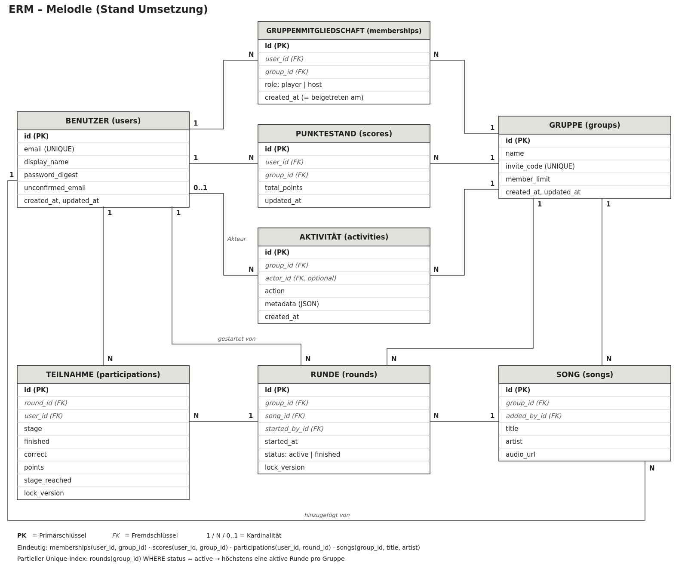

_Abbildung 1: ERM von Melodle (Stand Umsetzung)_

| Entität (Tabelle) | Zweck | Wichtige Regeln in der Datenbank |
|---|---|---|
| Benutzer (`users`) | Konto | `email` eindeutig, Passwort nur als bcrypt-Hash (`password_digest`) |
| Gruppe (`groups`) | Freundesgruppe | `invite_code` eindeutig, `member_limit` ≥ 1 (Standard 20) |
| Gruppenmitgliedschaft (`memberships`) | Benutzer ↔ Gruppe mit Rolle | eindeutig `(user_id, group_id)` |
| Punktestand (`scores`) | Gesamtpunkte pro Benutzer und Gruppe | eindeutig `(user_id, group_id)`, Index `(group_id, total_points)` für die Bestenliste |
| Song (`songs`) | Songliste einer Gruppe | eindeutig `(group_id, title, artist)` |
| Runde (`rounds`) | Ein Song, der erraten wird | **partieller Unique-Index** `group_id WHERE status = active`, `lock_version` |
| Teilnahme (`participations`) | Fortschritt und Ergebnis eines Spielers | eindeutig `(user_id, round_id)`, `lock_version` |
| Aktivität (`activities`) | Aktivitätsprotokoll | `actor_id` optional (Systemereignis), `metadata` als JSON |

_Tabelle 6: Entitäten und Datenbankregeln_

Alle Fremdschlüssel sind als Foreign-Key-Constraints angelegt, Pflichtfelder als `NOT NULL`. Die Regeln stehen also zusätzlich zu den Validierungen in den Models auch in der Datenbank. Das ist für die Nebenläufigkeit wichtig (Kapitel 10).

| ERM Projektantrag | Umsetzung | Grund |
|---|---|---|
| Zusammengesetzte Primärschlüssel bei Mitgliedschaft, Punktestand, Teilnahme | Eigene `id` plus eindeutiger Index über die Schlüsselspalten | Rails-Konvention, gleiche fachliche Wirkung |
| Benutzer `name`, `passwort_hash` | `display_name`, `password_digest`, zusätzlich `unconfirmed_email` | Rails-Namen (`has_secure_password`), E-Mail-Änderung mit Bestätigung |
| Teilnahme `richtig_geraten`, `punkte` | zusätzlich `stage`, `finished`, `stage_reached`, `lock_version` | Jeder Spieler hat seine eigene Stufe (asynchrone Runde) |
| Runde ohne Sperrspalte | `lock_version` | Optimistisches Locking |
| – | neue Entität Aktivität | Aktivitätsprotokoll (Kursaufgabe 7) |
| Punktestand `aktualisiert_am` | `updated_at` | Rails-Zeitstempel |

_Tabelle 7: Änderungen gegenüber dem ERM im Projektantrag_

## 7 Breadboards

Die Breadboards folgen der textuellen Kurskonvention (`@Place`, `- Element`, `-> @Ziel`, optional `(controller#action)`). Sie beschreiben alle User-Flows der 1. Iteration im umgesetzten Stand.

### 7.1 Registrieren und Anmelden

```text
@Anmelden (sessions#new)
  - E-Mail und Passwort
  - Anmelden (POST sessions#create)
    Erfolg -> @Dashboard
    Falsche Angaben -> @Anmelden
    Zu viele Versuche -> @Anmelden
  - Registrieren
    -> @Registrieren

@Registrieren (users#new)
  - Anzeigename, E-Mail, Passwort (mind. 12 Zeichen), Passwort bestätigen
  - Registrieren (POST users#create)
    Erfolg -> @Dashboard
    Ungültige Eingabe -> @Registrieren
  - Anmelden
    -> @Anmelden

@Dashboard (dashboards#show)
  - Anzeige: meine Gruppen, Badge «HOST» bei eigenen Gruppen
  - Gruppe öffnen
    -> @Gruppe
  - Gruppe erstellen
    -> @Gruppe erstellen
  - Gruppe beitreten
    -> @Gruppe beitreten
  - Abmelden (DELETE sessions#destroy)
    -> @Anmelden

@Gruppe
  - (definiert in 7.2)

@Gruppe erstellen
  - (definiert in 7.2)

@Gruppe beitreten
  - (definiert in 7.2)
```

- Nicht angemeldete Benutzer werden bei jeder geschützten Seite zu `@Anmelden` geleitet.
- Falsche E-Mail und falsches Passwort ergeben dieselbe Meldung (kein Hinweis, ob ein Konto existiert).

### 7.2 Gruppe erstellen, beitreten und Mitglieder verwalten

```text
@Gruppe erstellen (groups#new)
  - Name der Gruppe, Mitgliederlimit
  - Gruppe erstellen (POST groups#create)
    Erfolg -> @Gruppe
    Ungültige Eingabe -> @Gruppe erstellen

@Gruppe beitreten (joins#new)
  - Einladungscode
  - Beitreten (POST joins#create)
    Erfolg -> @Gruppe
    Unbekannter Code -> @Gruppe beitreten
    Gruppe voll -> @Gruppe beitreten
    Bereits Mitglied -> @Gruppe beitreten

@Gruppe (groups#show)
  - Anzeige: Einladungscode, Mitglieder / Mitgliederlimit
  - Hinweis «Es läuft eine Runde!»
    Jetzt mitspielen -> @Rate-Runde
    Runde gerade gestartet (Echtzeit) -> @Rate-Runde
  - Mitgliederliste mit Rolle
  - Mitglied entfernen (nur Host, DELETE memberships#destroy)
    Erfolg -> @Gruppe
    Keine Berechtigung -> @Gruppe
  - Songliste
    -> @Songliste
  - Bestenliste
    -> @Bestenliste
  - Aktivitäten
    -> @Aktivitäten

@Rate-Runde
  - (definiert in 7.4)

@Songliste
  - (definiert in 7.3)

@Bestenliste
  - (definiert in 7.5)

@Aktivitäten
  - (definiert in 7.5)
```

- Wer eine Gruppe erstellt, wird Host. Gruppe, Mitgliedschaft, Punktestand und Aktivität entstehen in einer Transaktion.
- Beim Beitritt entsteht eine Mitgliedschaft mit Rolle Spieler und ein Punktestand mit 0 Punkten.
- Gleichzeitige Beitritte dürfen das Mitgliederlimit nicht überschreiten.
- Der Host kann sich nicht selbst entfernen. Beim Entfernen wird der Punktestand gelöscht, die Teilnahmen bleiben erhalten.
- Nicht-Mitglieder erhalten für eine fremde Gruppe eine 404-Seite, auch mit bekannter ID.

### 7.3 Songliste verwalten und Runde starten

```text
@Songliste (songs#index)
  - Suche nach Titel oder Interpret (GET songs#index)
    -> @Songliste
  - Anzeige: Titel, Interpret, hinzugefügt von
  - Song hinzufügen: Titel, Interpret, Audio-Datei (nur Host, POST songs#create)
    Erfolg -> @Songliste
    Ungültige Eingabe -> @Songliste
  - Song entfernen (nur Host, DELETE songs#destroy)
    Erfolg -> @Songliste
    Schon in einer Runde gespielt -> @Songliste
  - Runde mit diesem Song starten (nur Host, POST rounds#create)
    Erfolg -> @Rate-Runde
    Es läuft bereits eine Runde -> @Rate-Runde
  - Runde mit zufälligem Song starten (nur Host, POST rounds#create)
    Erfolg -> @Rate-Runde
    Noch keine Songs -> @Songliste
  - Zurück zur Gruppe
    -> @Gruppe

@Rate-Runde
  - (definiert in 7.4)

@Gruppe
  - (definiert in 7.2)
```

- Songs gehören zu genau einer Gruppe. Derselbe Titel vom selben Interpreten kommt pro Gruppe nur einmal vor.
- Die Audio-Quelle muss ein Pfad (`/audio/…`) oder eine http(s)-URL sein.

### 7.4 Rate-Runde spielen

```text
@Rate-Runde (rounds#show, Runde aktiv, eigene Teilnahme offen)
  - Anzeige: Stufe x von 7, Länge des Ausschnitts, mögliche Punkte
  - Ausschnitt abspielen
  - Songtitel
  - Raten (POST guesses#create)
    Richtig -> @Eigenes Ergebnis
    Falsch -> @Rate-Runde
    Falsch auf letzter Stufe -> @Eigenes Ergebnis
    Runde inzwischen beendet -> @Rundenergebnis
  - Anzeige: schon gespielt (mit Punkten), noch offen (Echtzeit)
  - Runde jetzt beenden (nur Host, POST rounds#finish)
    -> @Rundenergebnis

@Eigenes Ergebnis (rounds#show, Runde aktiv, eigene Teilnahme fertig)
  - Anzeige: eigene Punkte, Songtitel und Interpret
  - Anzeige: schon gespielt, noch offen (Echtzeit)
    Alle fertig -> @Rundenergebnis
  - Runde jetzt beenden (nur Host, POST rounds#finish)
    -> @Rundenergebnis

@Rundenergebnis (rounds#show, Runde beendet)
  - Anzeige: Songtitel, Tabelle Spieler / erraten / Stufe / Punkte
  - Bestenliste
    -> @Bestenliste
  - Zurück zur Gruppe
    -> @Gruppe

@Bestenliste
  - (definiert in 7.5)

@Gruppe
  - (definiert in 7.2)
```

- Die Runde ist auf jeder Seite über das Banner «Jetzt mitspielen» erreichbar, bis der Spieler seine Teilnahme beendet hat.
- Die Stufe kommt aus der Teilnahme auf dem Server, nicht aus dem Browser.
- Ein Spieler gibt pro Runde höchstens so lange Tipps ab, bis er richtig liegt oder Stufe 7 verbraucht hat.
- Tipps in einer beendeten Runde werden abgelehnt.

### 7.5 Bestenliste, Aktivitäten und Profil

```text
@Bestenliste (leaderboards#show)
  - Anzeige: Platz (Gleichstand teilt den Platz), Spieler, Runden gespielt, Punkte
  - Anzeige: eigene Zeile hervorgehoben, aktualisiert sich in Echtzeit
  - Zurück zur Gruppe
    -> @Gruppe

@Aktivitäten (activities#index)
  - Anzeige: letzte 100 Ereignisse, neueste zuerst
  - Zurück zur Gruppe
    -> @Gruppe

@Profil (profiles#show)
  - Anzeige: Anzeigename, E-Mail, ausstehende E-Mail-Bestätigung
  - Profil bearbeiten
    -> @Profil bearbeiten
  - Passwort ändern
    -> @Passwort ändern

@Profil bearbeiten (profiles#edit)
  - Anzeigename, neue E-Mail
  - Speichern (PATCH profiles#update)
    Erfolg -> @Profil
    Neue E-Mail -> @Profil
    Ungültige Eingabe -> @Profil bearbeiten

@Passwort ändern (passwords#edit)
  - Aktuelles Passwort, neues Passwort, Bestätigung
  - Passwort ändern (PATCH passwords#update)
    Erfolg -> @Profil
    Aktuelles Passwort falsch -> @Passwort ändern
    Neues Passwort ungültig -> @Passwort ändern

@Gruppe
  - (definiert in 7.2)
```

- Eine neue E-Mail-Adresse wird erst übernommen, wenn der Link aus der Bestätigungs-E-Mail geöffnet wird (1 Stunde gültig). In der Entwicklungsumgebung steht der Link im Log.
- Das Profil hat keine ID in der URL. Jeder Benutzer erreicht nur sein eigenes Profil.

## 8 Screens

### 8.1 Wireframes (Projektantrag)

Die Wireframes aus dem Projektantrag dienten als Fat-Marker-Sketches für die Umsetzung. Die HTML-Quellen liegen unter `docs/01-login.html` bis `docs/05-bestenliste.html`.

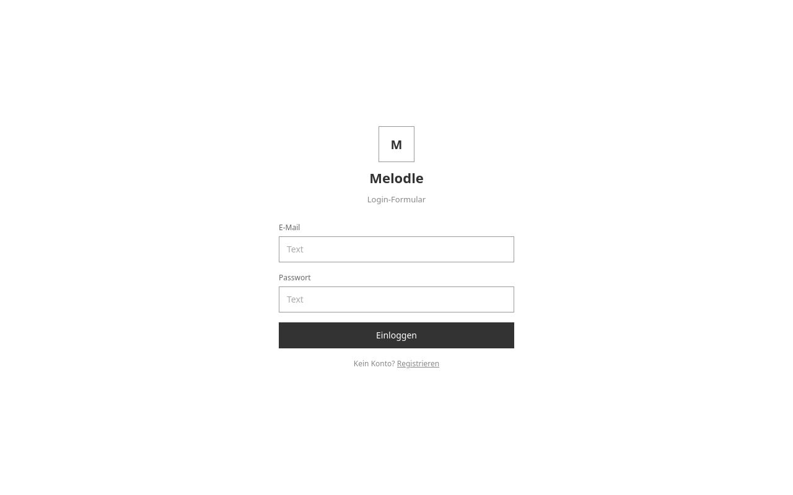

_Abbildung 2: Wireframe Login_

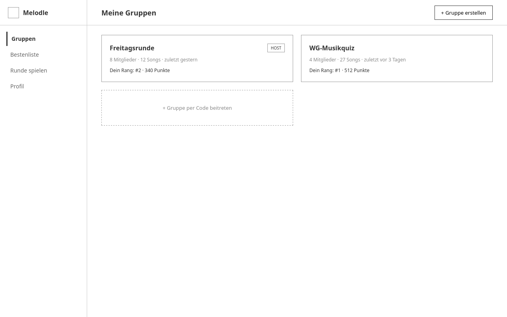

_Abbildung 3: Wireframe Gruppenübersicht_

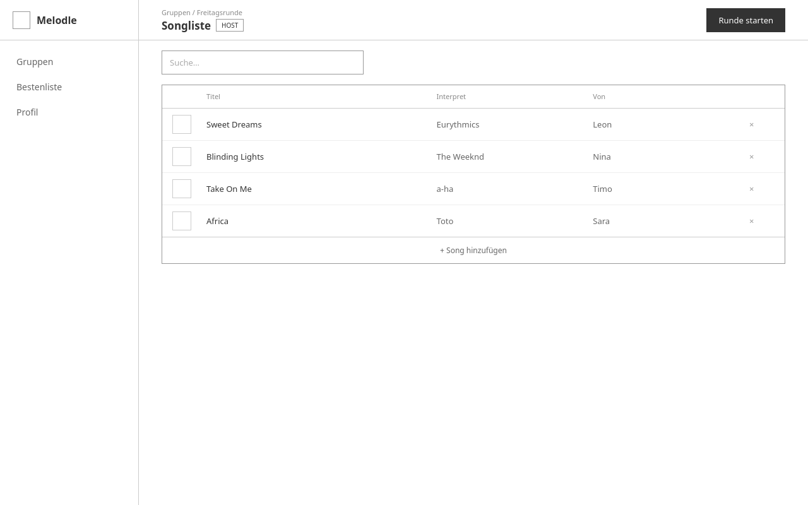

_Abbildung 4: Wireframe Songliste_

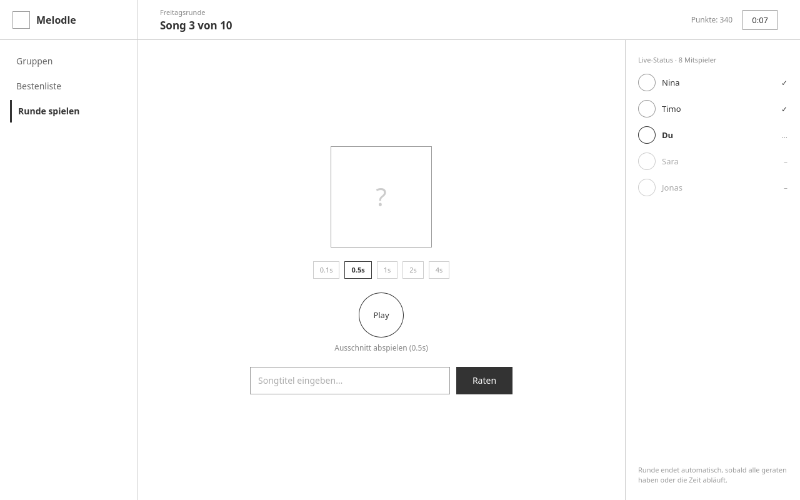

_Abbildung 5: Wireframe Rate-Runde_

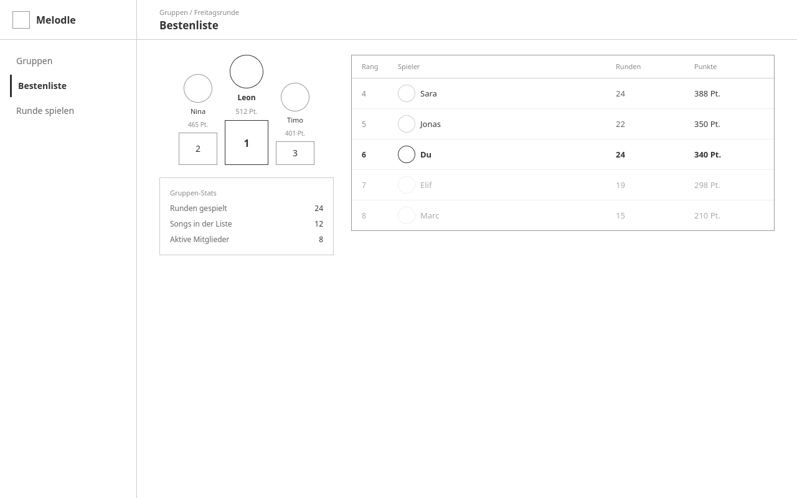

_Abbildung 6: Wireframe Bestenliste_

### 8.2 Umgesetzte Screens

Die Screenshots stammen aus der laufenden Applikation mit den Demo-Daten (`bin/rails db:seed`) und zwei gespielten Runden.

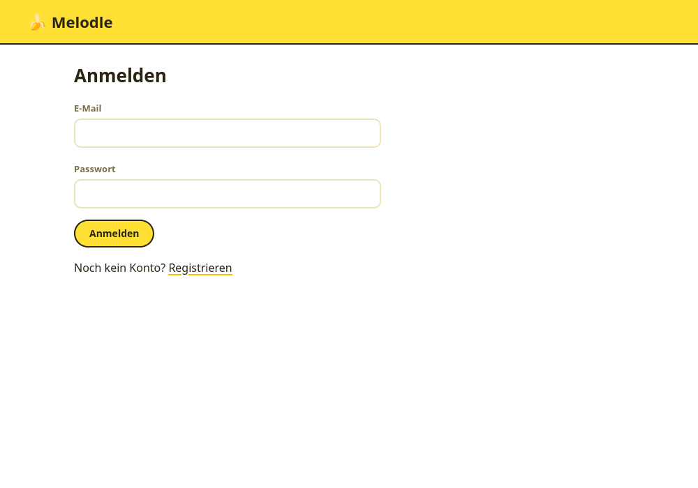

_Abbildung 7: Anmelden_

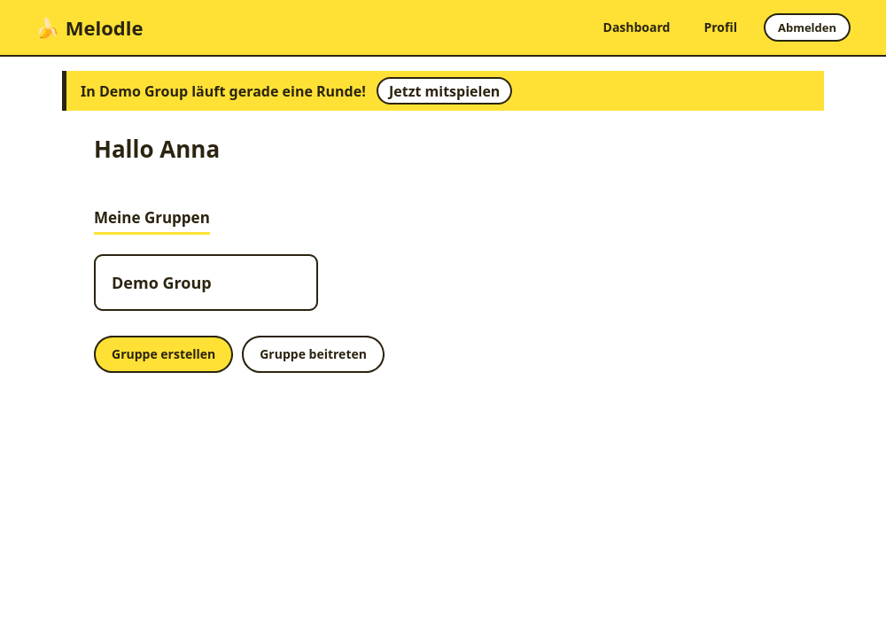

_Abbildung 8: Dashboard von Anna mit Banner «Jetzt mitspielen» für eine laufende Runde_

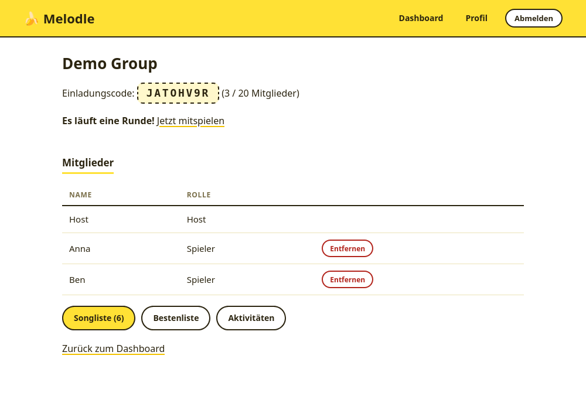

_Abbildung 9: Gruppe aus Sicht des Hosts (Einladungscode, Mitglieder, Entfernen)_

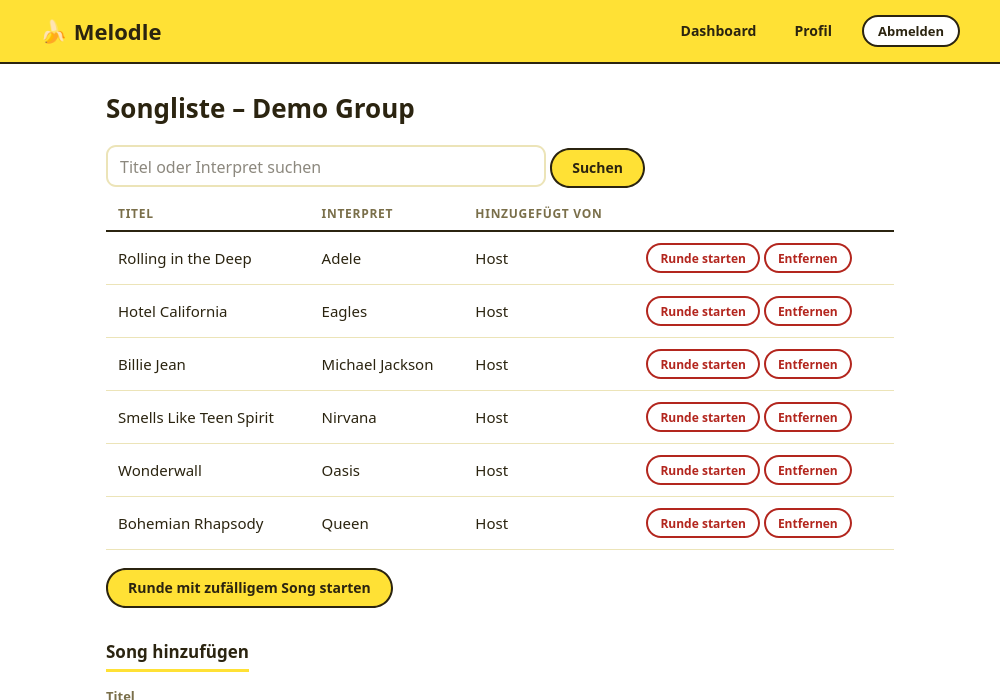

_Abbildung 10: Songliste aus Sicht des Hosts (Runde starten, Song entfernen, Song hinzufügen)_

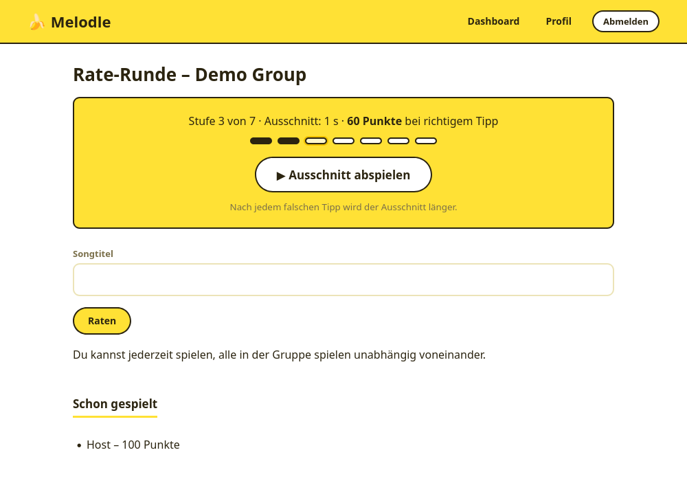

_Abbildung 11: Rate-Runde von Anna auf Stufe 3 nach zwei falschen Tipps_

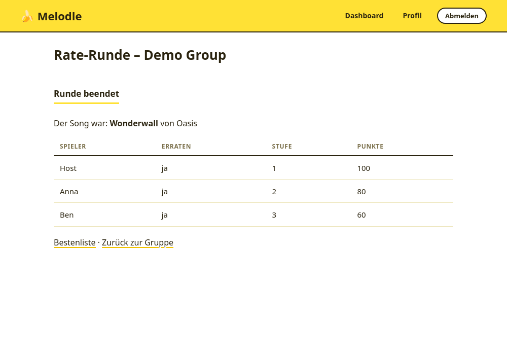

_Abbildung 12: Ergebnis einer beendeten Runde_

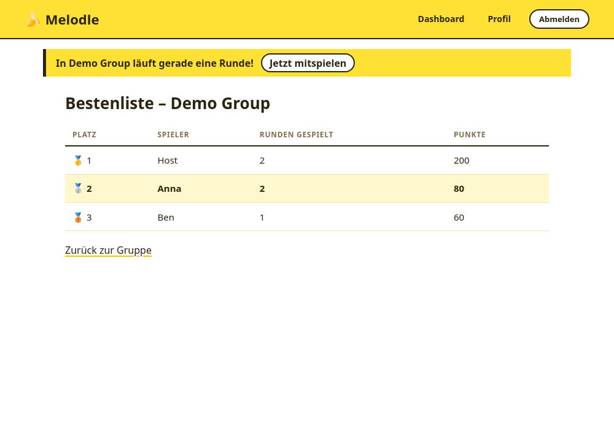

_Abbildung 13: Bestenliste, eigene Zeile hervorgehoben_

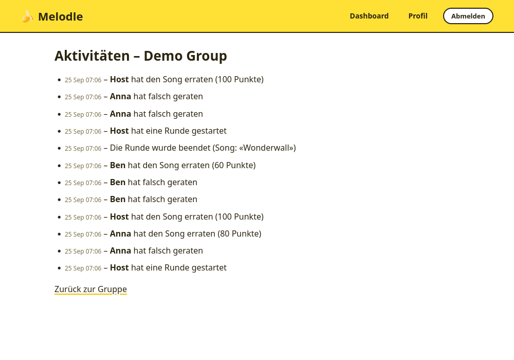

_Abbildung 14: Aktivitätsprotokoll der Gruppe_

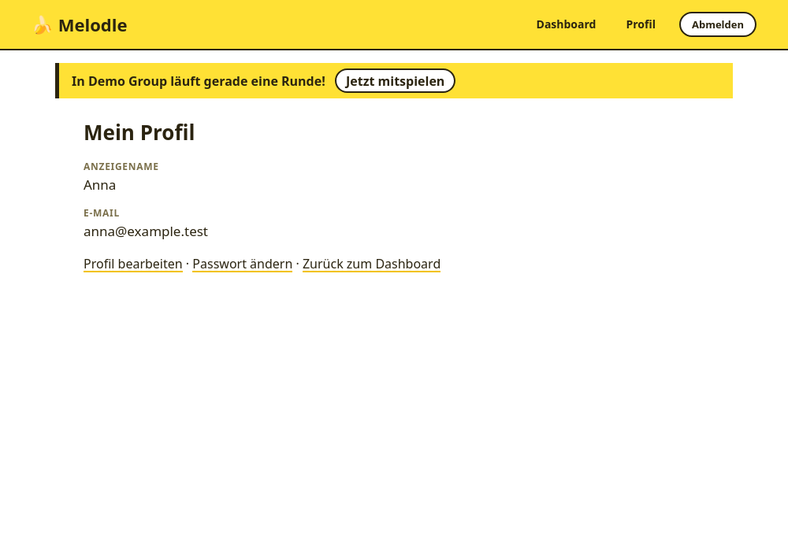

_Abbildung 15: Profil_

## 9 Architektur und Umsetzung

### 9.1 Technologie

| Bereich | Technologie | Version |
|---|---|---|
| Sprache | Ruby | 4.0.6 |
| Framework | Ruby on Rails | 8.1.3.1 |
| Datenbank | SQLite | 3 (Gem `sqlite3` 2.9.6) |
| Autorisierung | Pundit | 2.5.2 |
| Passwort-Hashing | bcrypt (`has_secure_password`) | 3.1.22 |
| Frontend | Turbo, Stimulus, Importmap, Propshaft | turbo-rails 2.0.23, stimulus-rails 1.3.4 |
| Echtzeit | Action Cable (Development: `async`, Production: Solid Cable) | solid_cable 4.0.2 |
| Tests | Minitest | 6.0.6 |
| Qualität | RuboCop (Rails Omakase), Brakeman, bundler-audit | – |

_Tabelle 8: Technologie-Stack_

### 9.2 Aufbau nach MVC

Melodle folgt den Rails-Konventionen. Die fachliche Logik liegt in den **Models**, die **Controller** prüfen Anmeldung und Berechtigung und übersetzen Ergebnisse in Meldungen, die **Views** zeigen nur an.

| Schicht | Ort | Inhalt |
|---|---|---|
| Models | `app/models` | `User`, `Group`, `Membership`, `Score`, `Song`, `Round`, `Participation`, `Activity`, `Current` |
| Fachlogik mit Transaktionen | Model-Methoden | `Group.create_with_host!`, `Group.join!`, `Group#remove_member!`, `Round.start!`, `Round#guess!`, `Round#finish!`, `Score#add_points!`, `User#request_email_change!` |
| Policies | `app/policies` | `GroupPolicy` (mit Scope), `MembershipPolicy`, `SongPolicy`, `RoundPolicy` |
| Controller | `app/controllers` | ein Controller pro Ressource, z. B. `RoundsController`, `GuessesController`, `JoinsController` |
| Views | `app/views` | ERB, deutsche Texte, Turbo-Stream-Abonnements |
| JavaScript | `app/javascript/controllers` | `clip_player_controller.js` (spielt den Ausschnitt), `auto_visit_controller.js` (öffnet eine frisch gestartete Runde) |

_Tabelle 9: Aufbau der Applikation_

### 9.3 Routen

| Methode | Pfad | Controller#Action | Zweck |
|---|---|---|---|
| GET / POST / DELETE | `/session/new`, `/session` | `sessions#new/create/destroy` | Anmelden, Abmelden |
| GET / POST | `/users/new`, `/users` | `users#new/create` | Registrieren |
| GET | `/dashboard` | `dashboards#show` | Meine Gruppen |
| GET / POST | `/groups/new`, `/groups` | `groups#new/create` | Gruppe erstellen |
| GET | `/groups/:id` | `groups#show` | Gruppe |
| DELETE | `/groups/:group_id/memberships/:id` | `memberships#destroy` | Mitglied entfernen |
| GET / POST / DELETE | `/groups/:group_id/songs` | `songs#index/create/destroy` | Songliste |
| POST | `/groups/:group_id/rounds` | `rounds#create` | Runde starten |
| GET | `/groups/:group_id/leaderboard` | `leaderboards#show` | Bestenliste |
| GET | `/groups/:group_id/activities` | `activities#index` | Aktivitäten |
| GET | `/rounds/:id` | `rounds#show` | Rate-Runde |
| POST | `/rounds/:id/finish` | `rounds#finish` | Runde vorzeitig beenden |
| POST | `/rounds/:round_id/guesses` | `guesses#create` | Tipp abgeben |
| GET / POST | `/join/new`, `/join` | `joins#new/create` | Beitritt per Code |
| GET / PATCH | `/profile`, `/profile/edit` | `profiles#show/edit/update` | Profil |
| GET / PATCH | `/password/edit`, `/password` | `passwords#edit/update` | Passwort ändern |
| GET | `/email_confirmations/:token` | `email_confirmations#show` | E-Mail bestätigen |

_Tabelle 10: Routen (`bin/rails routes`)_

### 9.4 Ablauf eines Tipps

1. `GuessesController#create` lädt die Runde nur aus den Gruppen des angemeldeten Benutzers (sonst 404) und prüft `RoundPolicy#guess?`.
2. `Round#guess!` sperrt die Runde (`with_lock`) und legt bei Bedarf die Teilnahme an.
3. Richtig: Teilnahme mit Punkten abschliessen, Punktestand atomar erhöhen, Aktivität schreiben.
   Falsch: Stufe erhöhen, Aktivität schreiben, auf Stufe 7 die Teilnahme mit 0 Punkten abschliessen.
4. Sind alle Mitglieder fertig, wird die Runde in derselben Transaktion beendet.
5. Nach dem Commit sendet das Model einen Broadcast. Alle offenen Seiten der Runde und der Gruppe laden sich neu.
6. Der Controller übersetzt das Ergebnis (`:correct`, `:wrong`, `:out_of_tries`, `:already`, `:closed`) in eine Meldung.

### 9.5 Echtzeit

Melodle verwendet **Turbo Page Refreshes mit Morphing** über Action Cable:

- Das Layout abonniert jede Gruppe des Benutzers (`turbo_stream_from group`), die Rundenseite zusätzlich die Runde.
- `Round` sendet beim Erstellen und bei jedem Statuswechsel einen Refresh, `Participation`, sobald ein Spieler fertig ist (`broadcast_refresh_later_to`).
- Die Browser laden die Seite neu und übernehmen nur die Unterschiede (Morphing). Jeder Benutzer sieht so seine eigene Ansicht (Tippformular, eigenes Ergebnis oder Spoiler-Schutz). Die Seiten müssen dafür nicht pro Benutzer als Fragmente gesendet werden.
- Wer die Gruppenseite offen hat, wird bei einer gerade gestarteten Runde (jünger als 5 Sekunden) automatisch zur Runde weitergeleitet (`auto_visit_controller.js`). Auf allen anderen Seiten erscheint das Banner «Jetzt mitspielen».

### 9.6 Audio-Ausschnitt

`clip_player_controller.js` spielt die Audio-Datei ab Sekunde 0 und stoppt sie nach der Länge der aktuellen Stufe (`setTimeout`). Die Länge liefert der Server in der View. Nach einem falschen Tipp lädt die Seite mit der nächsten Stufe neu. Die Demo-Songs sind selbst erzeugte Melodien mit neutralen Dateinamen (`public/audio/*.wav`), damit der Dateiname den Titel nicht verrät.

## 10 Locking und Transaktionen

### 10.1 Konzept

| Fall | Warum | Mechanismus |
|---|---|---|
| **Rundenstart**: nur eine aktive Runde pro Gruppe | Doppelklick oder Netzwerk-Retry des Hosts darf keine zweite Runde erzeugen | Partieller Unique-Index `rounds(group_id) WHERE status = 0`, `RecordNotUnique` → `Round::AlreadyActive` |
| **Ergebniserfassung**: eine Teilnahme pro Mitglied und Runde | Gleichzeitige Tipps (auch derselben Person) dürfen sich nicht überschreiben oder verdoppeln | Unique-Index `participations(user_id, round_id)`, Tipp unter Zeilensperre der Runde (`with_lock`), `lock_version` |
| **Punkteverbuchung**: Gesamtpunkte ohne Lost Update | Klassische Race Condition beim Hochzählen eines Zählers | `Score#add_points!` mit `update_counters`: ein einziges SQL `UPDATE … SET total_points = total_points + n` |
| **Gruppenbeitritt**: letzter freier Platz | Zwei Beitritte zum letzten Platz dürfen nicht beide bestätigt werden | Prüfung «voll?» und Aufnahme in einer Schreib-Transaktion (SQLite: `BEGIN IMMEDIATE`), Unique-Index gegen Doppelmitgliedschaft |
| **Änderung und Aktivität** | Das Protokoll muss zu den Daten passen | Aktivität in derselben Transaktion; schlägt sie fehl, wird die Änderung zurückgerollt |
| **E-Mail-Änderung** | Die Adresse soll nur gespeichert werden, wenn der Bestätigungslink erzeugt werden kann | Speichern und Mailversand in einer Transaktion |

_Tabelle 11: Locking- und Transaktionsfälle_

### 10.2 Umsetzung

**Rundenstart** (`app/models/round.rb`): Der Index lässt pro Gruppe nur eine Zeile mit `status = active` zu. Die zweite Anfrage scheitert in der Datenbank, nicht in einer vorherigen Abfrage. Deshalb ist die Lösung auch ohne Sperre frei von Race Conditions.

```ruby
def self.start!(group, song, user)
  transaction do
    round = group.rounds.create!(song: song, started_by: user, started_at: Time.current)
    Activity.record!(group: group, action: "round_started", actor: user)
    round
  end
rescue ActiveRecord::RecordNotUnique
  raise AlreadyActive
end
```

**Tipp und Punkteverbuchung** (`Round#guess!`): Die Runde wird für die Dauer des Tipps gesperrt (`SELECT … FOR UPDATE`, unter SQLite eine Schreib-Transaktion). So sind die Prüfung «Runde aktiv?», «Teilnahme schon fertig?» und «alle fertig?» mit dem Schreiben konsistent. Der Punktestand wird zusätzlich atomar in SQL erhöht:

```ruby
# app/models/score.rb
def add_points!(points)
  self.class.update_counters(id, total_points: points)
end
```

**Gruppenbeitritt** (`Group.join!`): Prüfen und Einfügen laufen in derselben Transaktion. Rails 8.1 startet SQLite-Transaktionen mit `BEGIN IMMEDIATE`. Dadurch wartet ein zweiter Beitritt, bis der erste abgeschlossen ist, und sieht dann die volle Gruppe.

```ruby
def self.join!(invite_code, user)
  transaction do
    group = find_by!(invite_code: invite_code.to_s.strip.upcase)
    raise AlreadyMember if group.memberships.exists?(user_id: user.id)
    raise Full if group.full?
    group.memberships.create!(user: user, role: :player)
    group.scores.find_or_create_by!(user: user)
    Activity.record!(group: group, action: "member_joined", actor: user)
    group
  end
rescue ActiveRecord::RecordNotUnique
  raise AlreadyMember
end
```

**Optimistisches Locking:** `rounds` und `participations` haben `lock_version`. Überschneiden sich zwei Änderungen am selben Datensatz, wirft Rails `ActiveRecord::StaleObjectError`. Der `ApplicationController` zeigt dann die Meldung «Jemand hat gleichzeitig etwas geändert. Bitte versuche es nochmal.»

**Nachweis:** `test/models/concurrency_test.rb` startet mehrere Threads mit eigener Datenbankverbindung gleichzeitig (letzter Platz mit 2 und 8 Threads, Doppelstart, 10 gleichzeitige Punkteverbuchungen, gleichzeitige Tipps). Kapitel 14 zeigt die Ergebnisse.

## 11 Sicherheit

| Thema | Umsetzung |
|---|---|
| Passwörter | bcrypt-Hash über `has_secure_password`, mindestens 12 Zeichen, nie im Klartext gespeichert |
| Timing-Angriffe beim Login | `User.authenticate_by` braucht gleich lang, ob die E-Mail existiert oder nicht. Die Fehlermeldung ist in beiden Fällen gleich |
| Brute Force | `rate_limit to: 10, within: 3.minutes` auf `sessions#create` |
| Session Fixation | `reset_session` bei Anmeldung, Registrierung und Abmeldung |
| Geschützte Bereiche | `before_action :require_login` in allen Controllern ausser Login, Registrierung und E-Mail-Bestätigung |
| Autorisierung | Pundit-Policies bei jeder Aktion auf Gruppendaten, Datensätze werden über `policy_scope` bzw. die Gruppen des Benutzers geladen (fremde IDs → 404) |
| Mass Assignment | Strong Parameters (`params.expect`). Rolle, Punkte und Benutzer-ID kommen nie aus dem Request (getestet) |
| CSRF | Rails-Standard, `csrf_meta_tags` im Layout (getestet) |
| SQL-Injection | Nur parametrisierte Abfragen, Suche mit `sanitize_sql_like` |
| XSS | ERB-Escaping, kein `html_safe` oder `raw` mit Benutzereingaben. `audio_url` nur als Pfad oder http(s) (kein `javascript:`) |
| E-Mail-Bestätigung | Signiertes Token (`generates_token_for`), 1 Stunde gültig, ungültig sobald sich `unconfirmed_email` ändert |
| Transport | `force_ssl` und `assume_ssl` in Production |
| Prüfwerkzeuge | `bin/brakeman`: 0 Warnungen · `bin/bundler-audit`: keine bekannten Schwachstellen · `bin/rubocop`: keine Befunde |

_Tabelle 12: Sicherheitsmassnahmen_

## 12 Aktivitätsprotokoll

Melodle protokolliert alle Änderungen der Kernfunktion in der Tabelle `activities`. Eigene Tabelle statt Gem, weil die Einträge fachlich lesbar sein müssen und in derselben Transaktion wie die Änderung entstehen sollen.

| Aktion | Auslöser | Akteur |
|---|---|---|
| `group_created` | Gruppe erstellt | Host |
| `member_joined` | Beitritt per Code | neues Mitglied |
| `member_removed` | Mitglied entfernt | Host |
| `song_added`, `song_removed` | Songliste geändert | Host |
| `round_started` | Runde gestartet (ohne Songtitel, Spoiler-Schutz) | Host |
| `guess_correct` (mit Punkten), `guess_wrong` (ohne Tipptext) | Tipp abgegeben | Spieler |
| `round_finished` (mit Songtitel) | Alle fertig oder Host beendet | System («Melodle») |

_Tabelle 13: Protokollierte Aktivitäten_

- Der Akteur ist `Current.user`, gesetzt aus der Session im `ApplicationController`, nie aus Request-Parametern.
- `Activity.record!` wird innerhalb der Transaktion der Änderung aufgerufen. Scheitert der Eintrag, wird auch die Änderung zurückgerollt (getestet für Gruppe, Rundenstart und Tipp).
- Namen und Titel stehen in `metadata`, damit der Feed auch nach dem Löschen eines Songs oder Mitglieds lesbar bleibt.
- Der Feed (`ActivitiesController#index`) zeigt die letzten 100 Einträge, neueste zuerst, nur für Mitglieder der Gruppe (Abbildung 14).

## 13 Fehlerbehandlung und User Feedback

| Situation | Verhalten |
|---|---|
| Ungültige Formulareingabe (Registrierung, Gruppe, Song, Profil, Passwort) | Status 422, Fehlerliste über dem Formular, Eingaben bleiben erhalten |
| Falsche Anmeldedaten | «E-Mail oder Passwort ist falsch.», E-Mail bleibt im Feld |
| Zu viele Anmeldeversuche | «Zu viele Versuche. Bitte warte kurz.» |
| Nicht angemeldet | Weiterleitung zum Login mit «Bitte melde dich zuerst an.» |
| Fehlende Berechtigung (z. B. Spieler startet Runde per direktem POST) | Zurück zur vorherigen Seite mit «Dazu hast du keine Berechtigung.», keine Änderung |
| Fremde oder unbekannte Gruppe/Runde | Deutsche 404-Seite ohne technische Details |
| Runde läuft bereits (Doppelklick) | Weiterleitung zur laufenden Runde mit «In dieser Gruppe läuft bereits eine Runde.» |
| Unbekannter Code, Gruppe voll, bereits Mitglied | Passende Meldung, Status 422, Code bleibt im Feld |
| Song schon gespielt | «… wurde schon in einer Runde gespielt und kann nicht entfernt werden.» |
| Tipp falsch / keine Versuche mehr / schon gespielt / Runde beendet | Jeweils eigene Meldung, Seite zeigt den nächsten möglichen Schritt |
| Gleichzeitige Änderung (`StaleObjectError`) | «Jemand hat gleichzeitig etwas geändert. Bitte versuche es nochmal.» |
| Ungültiger oder abgelaufener Bestätigungslink | «Der Bestätigungslink ist ungültig oder abgelaufen.» |
| Serverfehler | Statische Fehlerseiten `public/404.html`, `422.html`, `500.html` auf Deutsch |

_Tabelle 14: Fehlerfälle und Rückmeldungen_

Erfolgreiche Aktionen werden mit einer Flash-Meldung bestätigt (z. B. «Runde gestartet.», «Richtig! Du bekommst Punkte.»). Meldungen haben die ARIA-Rolle `status` bzw. `alert`.

## 14 Prüfung der Anforderungen

### 14.1 Vorgehen

Die Anforderungen werden mit automatisierten Tests (Minitest) geprüft, die Zeitziele der Echtzeit manuell. Ausführen mit `bin/rails test`.

**Ergebnis am 25.09.2026:** 97 Tests, 315 Assertions, 0 Fehler, 0 übersprungen. `bin/rubocop` ohne Befunde, `bin/brakeman` ohne Warnungen.

| Testart | Dateien | Inhalt |
|---|---|---|
| Modelltests | `test/models/user_test.rb`, `round_test.rb`, `schema_constraints_test.rb` | Validierungen, Stufen- und Punkteregel, Datenbank-Constraints |
| Policy-Tests | `test/policies/policies_test.rb` | Host, Spieler, Nicht-Mitglied für jede Aktion, Rolle pro Gruppe, Scope |
| Integrationstests | `test/integration/*_test.rb` | Anmeldung, Profil, Gruppen, Songs, Runden, Bestenliste, Aktivitäten, Fehlerbehandlung über echte HTTP-Requests |
| Nebenläufigkeitstests | `test/models/concurrency_test.rb` | Mehrere Threads mit eigener Datenbankverbindung gleichzeitig |

_Tabelle 15: Testarten_

### 14.2 Anforderungen und Ergebnisse

| Anforderung | Test | Ergebnis |
|---|---|---|
| FA 1 Registrieren, Anmelden, Passwort ≥ 12 | `authentication_test`, `user_test` | erfüllt |
| FA 2 Gruppe erstellen, Beitritt per Code | `groups_test` (Erstellen, Beitritt, unbekannter Code, doppelt, voll) | erfüllt |
| FA 3 Host stellt Songliste zusammen | `songs_test`, `policies_test` | erfüllt |
| FA 4 Host startet Runde, nur eine aktive Runde | `rounds_test`, `round_test`, `concurrency_test` | erfüllt |
| FA 5 Stufen 0.1 s bis 16 s, Stufe pro Spieler vom Server | `round_test` | erfüllt |
| FA 6 Punkte nach Stufe, 0 Punkte ohne Treffer, späteres Mitspielen | `round_test`, `rounds_test` | erfüllt |
| FA 7 Gemeinsame Bestenliste | `leaderboard_test` (Sortierung, Gleichstand, Runden gespielt) | erfüllt |
| FA 8 Mitglieder entfernen (nur Host, nicht sich selbst) | `groups_test`, `policies_test` | erfüllt |
| FA 9 Anzeigename ändern | `profile_test` (auch Passwort, E-Mail-Bestätigung) | erfüllt |
| Rollen und Berechtigungen, direkte Requests auf fremde Daten | `policies_test`, Integrationstests (404 bzw. Weiterleitung) | erfüllt |
| Aktivitätsprotokoll, Akteur aus Session, Rollback | `activities_test` | erfüllt |
| Fehlerbehandlung, CSRF, Strong Parameters | `error_handling_test` | erfüllt |
| QA 1 Rundenstart < 2 s bei allen | Broadcast bei Start, Tipp und Ende (`leaderboard_test`); Zeit manuell mit zwei Browsern | Broadcast erfüllt, Zeit nicht gemessen |
| QA 2 Gleichzeitige Ergebnisse ohne Verlust | `concurrency_test` (fünf Spieler gleichzeitig, derselbe Spieler zweimal) | erfüllt |
| QA 3 Punktesumme ohne Lost Update | `concurrency_test` (10 gleichzeitige Erhöhungen um 10 = 100) | erfüllt |
| QA 4 20 aktive Mitglieder | – | offen |
| QA 5 Bestenliste < 1 s aktualisiert | Broadcast bei Start, Tipp und Ende (`leaderboard_test`); Zeit manuell | Broadcast erfüllt, Zeit nicht gemessen |

_Tabelle 16: Anforderungen, Tests und Ergebnisse_

### 14.3 Aussagekraft der Tests

Um zu prüfen, ob die Tests Fehler wirklich finden, wurden Schutzmassnahmen kurz entfernt:

| Eingebauter Fehler | Erwartung | Beobachtung |
|---|---|---|
| `Score#add_points!` liest, addiert und schreibt statt `update_counters` | Nebenläufigkeitstest rot | rot (100 erwartet, 20 erhalten) |
| `SongPolicy` erlaubt jedem alles | Policy-Test rot | rot |
| `Group.join!` ohne Transaktion | Nebenläufigkeitstest rot | zuerst nicht rot, weil die Lücke zu klein war. Der Test verlangsamt deshalb `Group#full?` künstlich, danach rot |

_Tabelle 17: Aussagekraft der Tests_

Danach wurde alles wiederhergestellt und die Suite lief grün. Details und bekannte Testlücken: [tests.md](tests.md).

## 15 Erreichter Stand

Alle neun funktionalen Anforderungen der 1. Iteration sind umgesetzt und automatisiert getestet. Die Applikation startet mit einer frischen Kopie gemäss [README](../README.md) und enthält Demo-Daten.

| Kriterium (Kompetenznachweis) | Umsetzung in Melodle | Nachweis |
|---|---|---|
| Authentifizierung | Registrierung, Login, Logout, Passwort ≥ 12, Timing-Schutz, Rate Limit | Kapitel 11, `authentication_test` |
| Benutzerrollen und Berechtigungen | Host und Spieler pro Gruppe, Pundit-Policies mit Scope | Tabelle 4, `policies_test` |
| Benutzerprofil | Anzeigename, Passwort mit aktuellem Passwort, E-Mail mit Bestätigungslink | Abbildung 15, `profile_test` |
| Benutzerverwaltung | Host sieht Mitglieder mit Rolle, entfernt Mitglieder, verteilt Einladungscode | Abbildung 9, `groups_test` |
| Transaktionen und Locking | Vier Fälle aus dem Antrag plus Aktivität und E-Mail-Änderung | Kapitel 10, `concurrency_test` |
| Aktivitätsprotokoll | Eigene Tabelle, Feed pro Gruppe, gleiche Transaktion | Kapitel 12, `activities_test` |
| Fehlerbehandlung und User Feedback | Flash-Meldungen, 422 mit Eingaben, 404-Seite, Konfliktmeldungen | Kapitel 13, `error_handling_test` |
| Testing | 97 Tests in vier Testarten, Aussagekraft geprüft | Kapitel 14 |
| Kernfunktion | Rate-Runde mit Stufen, Punkten, Echtzeit und Bestenliste | Kapitel 4.3, 9.5, Abbildungen 10–13 |
| Datenbankmodell | ERM entspricht dem Schema, Constraints in der Datenbank | Kapitel 6 |

_Tabelle 18: Erreichter Stand je Bewertungskriterium_

**Demo-Ablauf:** Zwei Browserfenster (normal und privat) mit `host@example.test` und `anna@example.test` öffnen → Host startet in der Songliste eine Runde → Anna wird zur Runde weitergeleitet bzw. sieht das Banner → beide raten → Bestenliste aktualisiert sich. Fehlerfälle: zweiter Klick auf «Runde starten», Beitritt mit falschem Code, Spieler ruft eine fremde Gruppe auf.

## 16 Abweichungen vom Projektantrag

| Nr. | Projektantrag | Umsetzung | Begründung |
|---|---|---|---|
| 1 | Alle hören den Ausschnitt **gleichzeitig**. Die Stufen laufen für alle nach Zeit ab, bis jemand richtig rät. | **Asynchrone Runde:** Jeder Spieler spielt, wann er will, und hat seine eigene Stufe. Die Stufe steigt nur nach seinem eigenen falschen Tipp. Die Runde endet, wenn alle fertig sind oder der Host sie beendet. | In einer Freundesgruppe sind selten alle gleichzeitig online. Eine zeitgesteuerte Stufe ist bei Netzwerklatenz unfair und hätte einen Hintergrundjob gebraucht. Der Multi-User-Aspekt bleibt: gemeinsame Runde, Echtzeit-Updates, gleichzeitige Tipps. |
| 2 | QA 1 «erhalten den ersten Ausschnitt innerhalb von 2 s gleichzeitig» | Die Runde wird allen offenen Sitzungen innerhalb von 2 s angezeigt | Folge von Abweichung 1: Es gibt keinen gemeinsamen Startzeitpunkt mehr. |
| 3 | Wireframe «Song 3 von 10», Timer | Eine Runde = ein Song, kein Timer | Einfacheres Modell, passt zur asynchronen Runde. |
| 4 | Ergebniserfassung mit Locking auf Ebene des einzelnen Datensatzes | Zusätzlich Zeilensperre der Runde während eines Tipps | Die Prüfung «alle fertig?» und das Beenden der Runde müssen mit dem Tipp konsistent sein. SQLite sperrt beim Schreiben ohnehin die ganze Datenbank. Der Unique-Index pro Teilnahme bleibt. |
| 5 | Mitgliederlimit mit Sperre der Gruppe | Schreib-Transaktion (`BEGIN IMMEDIATE`) | `SELECT … FOR UPDATE` gibt es in SQLite nicht. Rails serialisiert Schreib-Transaktionen, das hat dieselbe Wirkung. |
| 6 | ERM mit zusammengesetzten Schlüsseln, ohne Aktivität | Surrogatschlüssel `id`, zusätzliche Spalten, neue Entität Aktivität | Siehe Tabelle 7. |
| 7 | Benutzerverwaltung (Kursaufgabe: Admin sieht alle Benutzer) | Mitgliederverwaltung durch den Host pro Gruppe, keine globale Admin-Rolle | In der Domäne gibt es niemanden, der alle Benutzer verwalten soll. Die Verwaltung gehört zur Gruppe. Das ist fachlich sinnvoller als eine zusätzliche Rolle. |
| 8 | Wireframes mit Seitenleiste, Albumcover, Live-Status mit Häkchen | Schlichteres Layout mit Kopfzeile, Liste «schon gespielt / noch offen», gelbes Farbschema | Weniger Aufwand, gleiche Informationen. |
| 9 | Echtzeit mit einzelnen Turbo-Stream-Fragmenten | Page Refresh mit Morphing | Jede Seite sieht pro Benutzer anders aus (Spoiler-Schutz). Ein Refresh rendert sie für jeden richtig. |
| 10 | Profil: Anzeigename | Zusätzlich Passwort und E-Mail mit Bestätigung | Kursaufgabe 3. |

_Tabelle 19: Abweichungen vom Projektantrag_

## 17 Verzeichnisse und Quellen

### Abbildungen

1. ERM von Melodle (Stand Umsetzung)
2. Wireframe Login
3. Wireframe Gruppenübersicht
4. Wireframe Songliste
5. Wireframe Rate-Runde
6. Wireframe Bestenliste
7. Anmelden
8. Dashboard mit Banner «Jetzt mitspielen»
9. Gruppe aus Sicht des Hosts
10. Songliste aus Sicht des Hosts
11. Rate-Runde auf Stufe 3
12. Ergebnis einer beendeten Runde
13. Bestenliste
14. Aktivitätsprotokoll
15. Profil

### Tabellen

1. Funktionale Anforderungen · 2. Qualitätsattribute · 3. Stufen und Punkte · 4. Berechtigungsmatrix · 5. Fachbegriffe · 6. Entitäten und Datenbankregeln · 7. Änderungen am ERM · 8. Technologie-Stack · 9. Aufbau der Applikation · 10. Routen · 11. Locking- und Transaktionsfälle · 12. Sicherheitsmassnahmen · 13. Protokollierte Aktivitäten · 14. Fehlerfälle · 15. Testarten · 16. Anforderungen und Ergebnisse · 17. Aussagekraft der Tests · 18. Erreichter Stand · 19. Abweichungen

### Weitere Dokumente im Projekt

- [Projektantrag](projektantrag_melodle.md) (genehmigter Stand vom 2. Kurstag)
- [Testnachweis](tests.md)
- [Umsetzungsplan](umsetzungsplan.md)
- [README](../README.md) (Installation, Start, Tests, Demo-Konten)

### Quellen

- Kursunterlagen ICT-Modul 223: Wegleitung Projektarbeit, Breadboard-Konvention, Projektaufgaben 1–9
- Ruby on Rails Guides (Active Record, Action Cable, Testing): https://guides.rubyonrails.org
- Pundit: https://github.com/varvet/pundit
- Shape Up (Breadboarding, Fat-Marker-Sketches): https://basecamp.com/shapeup
