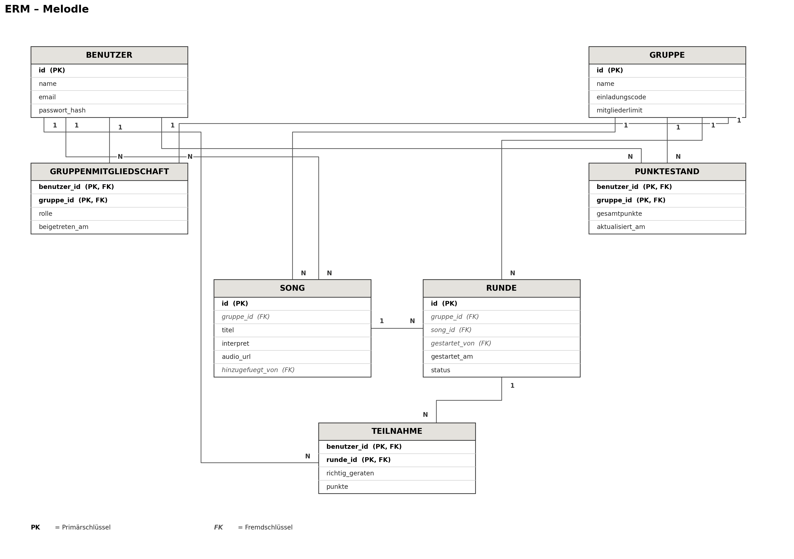

# Projektantrag: Melodle

**Vorname / Nachname:** Leon Troller

## Problemstellung

In meinem Freundeskreis hören wir sehr viel Musik gemeinsam und tauschen laufend Songs aus – dabei entsteht regelmässig die Diskussion, wer eigentlich das beste Musikgehör bzw. die beste Musikkenntnis hat. Bestehende Musik-Ratespiele wie Heardle-Klone sind entweder abgeschaltet oder als reine Einzelspieler-Anwendung mit einem global vorgegebenen Song des Tages konzipiert. Es gibt keine Möglichkeit, mit der eigenen Freundesgruppe eigene Songlisten zu verwenden, gemeinsam zur gleichen Zeit an einer Runde teilzunehmen und den Fortschritt über mehrere Runden hinweg in einer gemeinsamen Bestenliste zu verfolgen.

Diese Situation tritt bei uns mehrmals pro Woche auf, etwa bei Treffen oder in der gemeinsamen Gruppen-Chat, wenn wieder über Musikgeschmack diskutiert wird. Eine Multiuser-Applikation würde es erlauben, diese Diskussion spielerisch und mit klaren, nachvollziehbaren Ergebnissen auszutragen, anstatt sie unstrukturiert im Chat zu führen.

## Projekt

- **Domäne:** Musik & Unterhaltung (Social Gaming für Freundesgruppen)
- **Name der Applikation:** Melodle
- **Vision:** Melodle ermöglicht es Freundesgruppen, eigene Musik-Ratespiele mit selbst zusammengestellten Songlisten zu spielen. Ein Gruppenmitglied startet eine Runde, alle aktiven Mitglieder hören zur gleichen Zeit denselben Musikausschnitt – beginnend bei 0.1 Sekunden und in festen Schritten (0.5s, 1s, 2s, 4s, ...) länger werdend – und versuchen, den Song so früh wie möglich zu erraten. Je kürzer der benötigte Ausschnitt, desto mehr Punkte gibt es. Über alle Runden hinweg führt die Gruppe eine gemeinsame Bestenliste, wodurch aus der bisherigen Chat-Diskussion ein nachvollziehbarer, wiederkehrender Wettbewerb wird.

### Projektplanung: 1. MVP Iteration

Die wichtigste domänenspezifische Anforderung der ersten Iteration ist der vollständige Ablauf einer Rate-Runde innerhalb einer Gruppe: Der Host startet eine Runde, alle Gruppenmitglieder erhalten synchron denselben, stufenweise länger werdenden Musikausschnitt, geben ihren Tipp ab, und nach Rundenende wird die Punktzahl automatisch berechnet und in die gemeinsame Bestenliste der Gruppe eingetragen. Dazu gehören als Multi-User-Aspekte: das gemeinsame, gleichzeitige Erleben derselben Runde durch mehrere Nutzer sowie die korrekte, konfliktfreie Verarbeitung mehrerer gleichzeitig eingehender Ergebnisse und Punkteverbuchungen.

## Anforderungsanalyse

### Funktionale Anforderungen (priorisiert)

1. Benutzer können sich registrieren und einloggen.
2. Benutzer können eine Gruppe erstellen und weitere Mitglieder über einen Einladungscode hinzufügen.
3. Der Gruppenleiter (Host) kann eine eigene Songliste (Playlist) für seine Gruppe zusammenstellen.
4. Der Host kann eine neue Rate-Runde starten, die für alle aktiven Gruppenmitglieder gleichzeitig beginnt.
5. Während einer Runde hören alle Teilnehmer denselben Musikausschnitt, der bei 0.1 Sekunden beginnt und in festgelegten Schritten (0.5s, 1s, 2s, 4s, ...) länger wird, bis ein Mitglied richtig rät oder die maximale Ausschnittlänge erreicht ist, und geben dabei ihren Songtitel-Tipp ab.
6. Nach Abgabe des Tipps wird die Punktzahl automatisch anhand der Länge des benötigten Ausschnitts berechnet (kürzerer Ausschnitt = mehr Punkte); wird der Song bis zur maximalen Ausschnittlänge nicht richtig erraten, erhält das Mitglied 0 Punkte für diese Runde.
7. Nach Abschluss jeder Runde sehen alle Gruppenmitglieder eine gemeinsame Bestenliste (Leaderboard), sortiert nach der Gesamtpunktzahl über alle bisherigen Runden der Gruppe.
8. Der Host kann Gruppenmitglieder verwalten (hinzufügen und entfernen).
9. Benutzer können ihren Anzeigenamen im Profil bearbeiten.

### Qualitätsattribute

1. Echtzeit-Synchronität: Startet der Host eine Runde, erhalten alle aktiven Gruppenmitglieder den ersten Musikausschnitt innerhalb von 2 Sekunden gleichzeitig.
2. Nebenläufigkeitssicherheit bei Ergebnissen: Geben zwei Mitglieder derselben Gruppe innerhalb derselben Sekunde ihr Ergebnis ab, werden beide Einträge korrekt und unabhängig voneinander gespeichert, ohne dass einer der beiden verloren geht oder überschrieben wird.
3. Datenkonsistenz der Bestenliste: Schliessen zwei Mitglieder einer Gruppe eine Runde zeitgleich ab, wird die Punktesumme in der Bestenliste ohne doppelte oder fehlende Verbuchung korrekt berechnet.
4. Skalierbarkeit: Eine Gruppe unterstützt mindestens 20 gleichzeitig aktive Mitglieder pro Runde, ohne dass sich die Reaktionszeit beim Abspielen der Ausschnitte spürbar verschlechtert.
5. Aktualisierungsgeschwindigkeit: Die Bestenliste einer Gruppe wird spätestens 1 Sekunde nach Abschluss einer Runde für alle Mitglieder aktualisiert angezeigt.

### Benutzerrollen

1. **Gruppenleiter (Host):** Kann eine Gruppe erstellen, die Songliste der Gruppe zusammenstellen, Rate-Runden starten und Mitglieder hinzufügen oder entfernen.
2. **Gruppenmitglied (Spieler):** Kann einer Gruppe über einen Einladungscode beitreten, an gestarteten Runden teilnehmen, sein Ergebnis abgeben und die gemeinsame Bestenliste einsehen.

### Locking und Transaktionen

- **Rundenstart:** Pro Gruppe darf zu jedem Zeitpunkt nur eine Runde aktiv sein. Löst der Host durch einen Doppelklick oder einen Netzwerk-Retry zwei Startanfragen gleichzeitig aus, darf nur eine Runde tatsächlich angelegt werden – die Erstellung muss transaktional an die Bedingung "keine aktive Runde vorhanden" gebunden sein.
- **Ergebniserfassung:** Pro Mitglied und Runde darf nur ein Teilnahme-Datensatz (richtig geraten: ja/nein, Punkte) existieren. Geben mehrere Mitglieder gleichzeitig ihr Ergebnis ab, dürfen sich die einzelnen Teilnahme-Datensätze nicht gegenseitig überschreiben; hier genügt ein Locking auf Ebene des einzelnen Datensatzes, kein globales Sperren der Runde.
- **Punkteverbuchung:** Schliessen mehrere Mitglieder ihre Teilnahme an einer Runde zeitgleich ab, muss die Aktualisierung der Gesamtpunktzahl im Punktestand (pro Mitglied und Gruppe) atomar erfolgen, damit bei gleichzeitigen Schreibzugriffen kein Zwischenstand verloren geht (klassische Race Condition beim Erhöhen eines Zählerwerts).
- **Gruppenbeitritt bei begrenzter Mitgliederzahl:** Hat eine Gruppe ein Mitgliederlimit und treten zwei Nutzer gleichzeitig über denselben Einladungscode dem letzten freien Platz bei, darf die Aufnahme transaktional nur für einen der beiden Nutzer bestätigt werden.

### ERM (Entity-Relationship-Model)

Das Datenmodell umfasst die Entitäten Benutzer, Gruppe, Gruppenmitgliedschaft (verknüpft Benutzer und Gruppe, da ein Benutzer mehreren Gruppen angehören kann), Song, Runde, Teilnahme (verknüpft Benutzer und Runde mit dem Ergebnis richtig_geraten und den erzielten Punkten) sowie Punktestand (verknüpft Benutzer und Gruppe mit der Gesamtpunktzahl, da die Bestenliste pro Gruppe geführt wird). Das vollständige ERM inklusive Attributen, Schlüsseln und Kardinalitäten ist als Grafik beigelegt:

### Breadboards

[Hier würden handgezeichnete Skizzen der wichtigsten User-Flows eingefügt werden, z.B. für Registrierung/Login, Gruppe erstellen und Songliste zusammenstellen, einer Gruppe per Einladungscode beitreten, eine Rate-Runde starten und daran teilnehmen (Ausschnitt hören, Tipp abgeben), sowie das Einsehen der Bestenliste.]

### Fat-Marker-Sketches

Siehe beiliegende Wireframes (Login, Gruppenübersicht, Songlisten-Verwaltung, Rate-Runde, Bestenliste).
