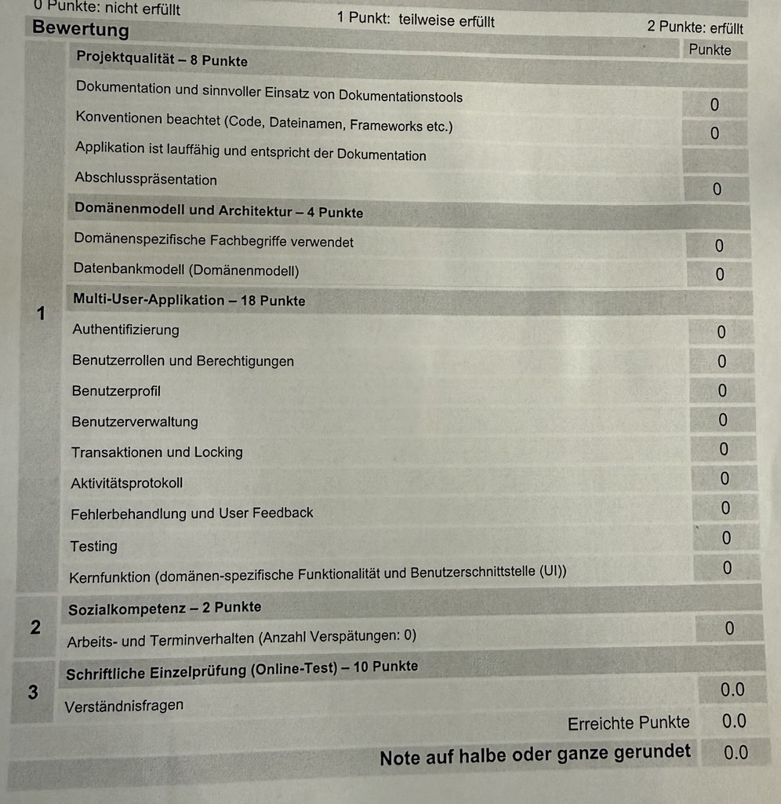

# Melodle – Umsetzungsplan von 0 bis zur Abgabe

Schritt-für-Schritt-Anleitung, als gäbe es noch nichts im Projekt. Jede Phase endet mit einer **Checkliste** und einem **Commit**. Die Reihenfolge folgt dem Kursplan (Tag 3–5) und der Wegleitung.

> Konvention: Code, Tabellen, Spalten, Klassen, Variablen sind **englisch**. Dokumentation und UI-Texte dürfen deutsch sein. Die ERM-Begriffe entsprechen den englischen Modellen: Benutzer = `User`, Gruppe = `Group`, Gruppenmitgliedschaft = `Membership`, Song = `Song`, Runde = `Round`, Teilnahme = `Participation`, Punktestand = `Score`.

## Übersicht

| Phase | Inhalt | Kurs-Aufgabe | Bewertungskriterium |
|---|---|---|---|
| 0 | Arbeitsplatz, Repo, Rails-Projekt | Setup | Konventionen |
| 1 | Dokumentation abschliessen (Breadboards, ERM prüfen) | Projektantrag | Dokumentation, Fachbegriffe, Datenbankmodell |
| 2 | Datenbank und Modelle | Aufgabe 1 | Datenbankmodell, Fachbegriffe |
| 3 | Authentifizierung | Aufgabe 2 | Authentifizierung |
| 4 | Profil | Aufgabe 3 | Benutzerprofil |
| 5 | Gruppen, Einladungscode, Mitgliederverwaltung | Aufgabe 4 | Benutzerverwaltung, Transaktionen und Locking |
| 6 | Rollen und Berechtigungen (Pundit) | Aufgabe 5 | Benutzerrollen und Berechtigungen |
| 7 | Songliste | Aufgabe 6 | Kernfunktion |
| 8 | Kernfunktion: Rate-Runde | Aufgabe 6 | Kernfunktion, Transaktionen und Locking |
| 9 | Echtzeit und Bestenliste | Aufgabe 6 | Kernfunktion (UI) |
| 10 | Aktivitätsprotokoll | Aufgabe 7 | Aktivitätsprotokoll |
| 11 | Tests | Aufgabe 8 | Testing |
| 12 | Fehlerbehandlung, Sicherheit, Feinschliff | Bewertung | Fehlerbehandlung, Konventionen, lauffähig |
| 13 | Doku, README, Präsentation, Abgabe | Tag 5 | Dokumentation, Präsentation, lauffähig, Prüfung |

---

## Bewertungsraster (Vorlage: `Bewertung.jpeg`)



Skala pro Kriterium: **0** = nicht erfüllt · **1** = teilweise erfüllt · **2** = erfüllt. Maximal **42 Punkte**, die Note wird auf halbe oder ganze Note gerundet.

| Bereich | Kriterium | Max. | Phase(n) | Was zu zeigen ist |
|---|---|---|---|---|
| **1 Projektqualität (8)** | Dokumentation und sinnvoller Einsatz von Dokumentationstools | 2 | 1, 13 | Markdown-Doku mit Bildern, ERM, Breadboards, Testnachweis |
| | Konventionen beachtet (Code, Dateinamen, Frameworks) | 2 | 0, 12 | Englischer Code, Rails-Konventionen, `bin/rubocop` grün |
| | Applikation ist lauffähig und entspricht der Dokumentation | 2 | 12, 13 | Frische Kopie startet; ERM/Doku = Umsetzung; README stimmt |
| | Abschlusspräsentation | 2 | 13 | 5–10 Min., Live-Demo mit Fehlerfällen, Reserve-Screenshots |
| **1 Domänenmodell und Architektur (4)** | Domänenspezifische Fachbegriffe verwendet | 2 | 1, 2, 13 | Einheitliche Begriffe (Gruppe/Group, Runde/Round, Teilnahme/Participation, Punktestand/Score) in Code, UI, Doku |
| | Datenbankmodell (Domänenmodell) | 2 | 1, 2 | ERM aktuell, Constraints/Indizes, Seeds |
| **1 Multi-User-Applikation (18)** | Authentifizierung | 2 | 3 | Registrierung, Login, Logout, Passwort ≥ 12, geschützter Bereich |
| | Benutzerrollen und Berechtigungen | 2 | 6 | Host/Spieler/Nicht-Mitglied, Pundit, Policy-Tests |
| | Benutzerprofil | 2 | 4 | Anzeigename, Passwort, E-Mail ändern |
| | Benutzerverwaltung | 2 | 5 | Mitglieder ansehen/entfernen, Einladungscode |
| | Transaktionen und Locking | 2 | 5, 8, 9, 10, 11 | Die vier Locking-Fälle + Aktivität in Transaktion, mit Tests |
| | Aktivitätsprotokoll | 2 | 10 | Feed, Akteur aus `Current.user`, Rollback-Test |
| | Fehlerbehandlung und User Feedback | 2 | 12 | Flash, 422, 404-Seite, Konfliktmeldungen, Eingaben bleiben |
| | Testing | 2 | 11 | Modell-, Policy-, Integrations-, Nebenläufigkeitstests, alles grün |
| | Kernfunktion (domänenspezifische Funktionalität und UI) | 2 | 8, 9 | Rate-Runde, Punkte, Echtzeit, Bestenliste |
| **2 Sozialkompetenz (2)** | Arbeits- und Terminverhalten (Anzahl Verspätungen: 0) | 2 | alle | Termine einhalten, Abgabe pünktlich |
| **3 Schriftliche Einzelprüfung (10)** | Verständnisfragen (Online-Test) | 10 | alle | Selbst verstehen: Locking, Transaktionen, Pundit, Tests erklären können |

> Jedes Kriterium ist mit 2 Punkten nur voll erfüllt, wenn es **umgesetzt, dokumentiert und demonstrierbar** ist. Am Ende jeder Phase kurz prüfen, welche Zeile der Tabelle damit abgedeckt ist.

---

## Phase 0 – Arbeitsplatz und Projektgerüst

1. **Software prüfen** (siehe `setup.md` der Kursunterlagen):
   ```bash
   ruby -v      # 4.0.6
   rails -v     # 8.1.3.1
   git --version
   sqlite3 --version
   ```
   Fehlt etwas: Ruby mit `mise use --global ruby@4.0.6`, dann `gem install bundler` und `gem install rails -v 8.1.3.1`.
2. **Rails-Projekt erstellen** (im leeren Repo-Ordner oder daneben und Inhalt verschieben):
   ```bash
   rails new . --name melodle --asset-pipeline propshaft
   ```
3. **JSON-Einschränkung**: im `Gemfile` ergänzen `gem "json", "~> 2.0"`, dann `bundle install`.
4. **`mise.toml`** mit `ruby = "4.0.6"` im Projekt ablegen (`mise trust`, `mise install`).
5. **Start prüfen**: `bin/rails server` → http://localhost:3000 zeigt die Rails-Willkommensseite.
6. **Ordnerstruktur** anlegen: `docs/` (Doku + Bilder unter `docs/images/`), Wireframes bleiben in `docs/`.
7. **`AGENTS.md`/`CLAUDE.md`** im Projekt: Testbefehl (`bin/rails test`), Breadboard-Konvention, Regel «Tests nie überspringen».
8. **Commit**: `git add . && git commit -m "Rails-Projekt initialisiert"`.

**Checkliste:** Server läuft · `bin/rails test` läuft (0 Tests) · Commit vorhanden.

---

## Phase 1 – Dokumentation abschliessen (vor dem Coding!)

Der Projektantrag muss vom Kursleiter **genehmigt** sein, bevor entwickelt wird.

1. **Projektantrag** liegt als `docs/projektantrag_melodle.md` vor (alte Datei `projektantrag_melodle_new.md` ersetzt); PDF-Export für die Abgabe.
2. **ERM** (`docs/erm_melodle.png`) ist aktualisiert. Entscheidungen, die bereits gefallen sind:
   - **Mehrere Gruppen pro Benutzer:** ja, über `Membership` (`user_id`, `group_id`, `role`; «beigetreten am» = `created_at`). Die Rolle (Host/Spieler) gilt pro Gruppe.
   - **Bestenliste:** eigene Entität `Score` (Punktestand: `user_id`, `group_id`, `total_points`, unique `[user_id, group_id]`), nicht mehr in `Membership`.
   - **Songs** gehören zu einer Gruppe (`group_id`, `added_by_id`); **eine Runde = ein Song** (Wireframe-Text «Song 3 von 10» entsprechend anpassen).
   - **Lock-Spalten:** `lock_version` auf `participations` und `rounds`.
   - Noch offen: Entity `activities` (Phase 10) im ERM ergänzen; optional `guesses`, falls falsche Tipps gespeichert werden sollen.
3. **Breadboards** in Textkonvention (siehe `guides/shape-up/breadboards.md`) in `docs/breadboards.md` schreiben – alle Flows der 1. Iteration:
   - Registrieren / Einloggen
   - Gruppe erstellen, per Code beitreten
   - Songliste verwalten
   - Runde starten und spielen
   - Bestenliste
   Beispiel:
   ```text
   @Round (rounds#show)
     - Clip player and stage indicator
     - Guess input
     - Guess (POST guesses#create)
       Correct -> @Round result
       Wrong -> @Round
       Time over -> @Round result
   ```
4. **Wireframes** (`01-…05-*.html`) als Bilder exportieren (Screenshot) nach `docs/images/` und in der Doku einbinden.
5. **Regeln als Sätze** festhalten (Punktetabelle, siehe Phase 8).
6. `docs/README.md` aktualisieren (Verweise auf die neuen Dateien).

**Checkliste:** Antrag genehmigt · ERM konsistent zu Wireframes · Breadboards vorhanden · Bilder in `docs/images/`.

---

## Phase 2 – Datenbank und Modelle (Aufgabe 1)

Modell (entspricht dem ERM):

| Model | Wichtige Spalten |
|---|---|
| `User` | `email` (unique), `password_digest`, `display_name` |
| `Group` | `name`, `invite_code` (unique), `member_limit` |
| `Membership` | `user_id`, `group_id`, `role` (enum: player/host); **unique** `[user_id, group_id]` |
| `Score` | `user_id`, `group_id`, `total_points` (default 0); **unique** `[user_id, group_id]`, Index `[group_id, total_points]` |
| `Song` | `group_id`, `title`, `artist`, `audio_url`, `added_by_id` (→ users) |
| `Round` | `group_id`, `song_id`, `started_by_id`, `started_at`, `status` (enum: active/finished), `lock_version` |
| `Participation` | `user_id`, `round_id`, `correct` (bool), `points` (int), `stage_reached`, `lock_version`; **unique** `[user_id, round_id]` |

> **Stand:** Phase 2 ist umgesetzt (Migrationen, Modelle inkl. `Score`, Seeds, `test/models/schema_constraints_test.rb`).

Schritte:

1. **Generatoren** (Authentifizierung kommt in Phase 3, `User` entsteht dort):
   ```bash
   bin/rails g model Group name:string invite_code:string:uniq member_limit:integer
   bin/rails g model Membership user:references group:references role:integer
   bin/rails g model Score user:references group:references total_points:integer
   bin/rails g model Song group:references title:string artist:string audio_url:string added_by:references
   bin/rails g model Round group:references song:references started_by:references started_at:datetime status:integer lock_version:integer
   bin/rails g model Participation user:references round:references correct:boolean points:integer stage_reached:integer lock_version:integer
   ```
   `added_by` und `started_by` per Hand auf `foreign_key: { to_table: :users }` umstellen.
2. **Migrationen anpassen**: `null: false`, `default: 0` (`total_points`, `points`, `lock_version`), Unique-Indizes:
   - `memberships` und `scores`: `[user_id, group_id]` unique
   - `participations`: `[user_id, round_id]` unique
   - **Nur eine aktive Runde pro Gruppe**: partieller Unique-Index
     ```ruby
     add_index :rounds, :group_id, unique: true, where: "status = 0", name: "index_rounds_one_active_per_group"
     ```
3. **Modelle**: Assoziationen (`has_many`, `belongs_to`), Enums (`enum :status, { active: 0, finished: 1 }`), Validierungen (`presence`, Länge, `member_limit >= 1`).
4. **Einladungscode**: `has_secure_token :invite_code` oder `before_create` mit `SecureRandom.alphanumeric(8).upcase`.
5. `bin/rails db:migrate` und `db/schema.rb` prüfen.
6. **Seeds** (`db/seeds.rb`): Demo-Konten (z. B. `host@example.test`, `anna@example.test`, `ben@example.test`, Passwort mind. 12 Zeichen), eine Gruppe mit Memberships und je einem `Score` pro Mitglied, 5–10 Songs. Test mit `bin/rails db:seed`.
7. Commit.

**Checkliste:** `bin/rails db:migrate` ohne Fehler · Console-Test: Gruppe, Mitglieder, Scores, Songs anlegen · Unique-Index verhindert Duplikate.

---

## Phase 3 – Authentifizierung (Aufgabe 2)

> **Stand:** umgesetzt (eigene Implementierung statt Generator: `UsersController`, `SessionsController` mit `authenticate_by` und `rate_limit`, Dashboard geschützt, Tests in `test/integration/authentication_test.rb`).

1. `bin/rails generate authentication` (erzeugt `User`, `Session`, `SessionsController`, `PasswordsController`, `Authentication`-Concern) → `bin/rails db:migrate`.
2. `User`-Modell: `has_secure_password`, `normalizes :email_address`, `validates :email_address, presence, uniqueness`, **`validates :password, length: { minimum: 12 }`**, `display_name` präsent (Migration ergänzen).
3. **Registrierung**: `RegistrationsController` (`new`, `create`), Route `/signup`, `skip_before_action :require_authentication`. Nach Erfolg: Session starten, weiterleiten zum Dashboard.
4. **Timing-Schutz**: Login mit `User.authenticate_by(email_address:, password:)` (macht Timing-Angriffe unwirksam); gleiche Fehlermeldung für falsche E-Mail und falsches Passwort.
5. **Rate Limiting** im `SessionsController` (`rate_limit to: 10, within: 3.minutes`, wird vom Generator bereits gesetzt – prüfen).
6. **Geschützter Bereich**: `DashboardController#index` (zeigt Gruppenübersicht, Wireframe 02); `root` darauf setzen; nicht eingeloggte Nutzer landen beim Login.
7. **Navigation** im Layout: Login/Registrieren bzw. Abmelden (`data: { turbo_method: :delete }`).
8. Formulare: Fehler mit Status `422` rendern, Eingaben behalten.
9. **Views** nach Wireframe 01 (Login) gestalten.
10. Commit.

**Checkliste:** Registrieren, Einloggen, Ausloggen · kurzes Passwort abgelehnt · ohne Login kein Dashboard · Passwort im Klartext nirgends gespeichert.

---

## Phase 4 – Profil (Aufgabe 3)

> **Stand:** umgesetzt. `ProfilesController` (Anzeigename, E-Mail-Änderung), `PasswordsController`, `EmailConfirmationsController`, `UserMailer`. Statt Token-Spalten wird `generates_token_for :email_confirmation` (signiert, 1 h gültig, ungültig sobald `unconfirmed_email` wechselt) verwendet; nur `users.unconfirmed_email` ist neu. Tests: `test/integration/profile_test.rb`. Im Development landet der Link im Log (`delivery_method = :test`).

1. Singular Resource `resource :profile` → `ProfilesController#show/edit/update`.
2. Anzeigename ändern (Anforderung 9).
3. Passwort ändern: aktuelles Passwort verlangen, neues mind. 12 Zeichen.
4. E-Mail ändern (Kursvorgabe): Spalten `unconfirmed_email`, `email_confirmation_token`; Bestätigungslink per Mailer erzeugen, im Development nur ins Log schreiben (`Rails.logger.debug`); Bestätigung setzt `email_address`. Änderung und Mailversand in **einer Transaktion**.
5. Nur das eigene Profil ist erreichbar (kein `:id` in der Route).
6. Commit.

**Checkliste:** Profil ändern funktioniert · fremde Profile nicht erreichbar · E-Mail-Link im Log sichtbar.

---

## Phase 5 – Gruppen und Mitglieder (Aufgabe 4, Anforderungen 2 und 8)

> **Stand:** umgesetzt. Logik im Model (`Group.create_with_host!`, `Group.join!`, `Group#remove_member!`), Controller `GroupsController`, `JoinsController`, `MembershipsController`; die «Meine Gruppen»-Liste ist das Dashboard. Locking beim Beitritt: Rails 8.1 startet SQLite-Transaktionen mit `BEGIN IMMEDIATE`, dadurch werden Schreib-Transaktionen serialisiert (`Group.lock` ist unter SQLite wirkungslos und wurde weggelassen); Doppelmitgliedschaft fängt der Unique-Index. Beim Entfernen wird der `Score` gelöscht. Die Host-Prüfung im `MembershipsController` ist provisorisch und wird in Phase 6 durch Pundit ersetzt. Tests: `test/integration/groups_test.rb`. Ein echter Thread-Test für den letzten Platz folgt in Phase 11.

1. `GroupsController`: `index` (Meine Gruppen), `new/create`, `show`.
   - Beim Erstellen wird der Ersteller **Host** (Membership mit `role: host`) – Gruppe, Membership und `Score` in **einer Transaktion**.
2. **Beitreten per Code**: `JoinsController#new/create` (oder `groups/join`): Code eingeben → Gruppe suchen → Membership anlegen.
   - **Locking (Anforderung «letzter Platz»)**:
     ```ruby
     Group.transaction do
       group = Group.lock.find_by!(invite_code: code)   # unter SQLite: BEGIN IMMEDIATE
       raise GroupFull if group.memberships.count >= group.member_limit
       group.memberships.create!(user: current_user, role: :player)
       group.scores.create!(user: current_user)   # Punktestand für diese Gruppe
     end
     ```
     Doppelte Mitgliedschaft fängt der Unique-Index (`ActiveRecord::RecordNotUnique`) ab.
3. **Mitgliederverwaltung** (Host): Liste der Mitglieder, Entfernen (`MembershipsController#destroy`), Einladungscode anzeigen. Beim Entfernen bleibt der `Score` bestehen oder wird mit entfernt – Entscheid dokumentieren (Empfehlung: Score löschen, Teilnahmen bleiben).
4. Views nach Wireframe 02 (Gruppenkarten mit Rolle-Badge «HOST»).
5. Fehlerfälle: falscher Code, Gruppe voll, schon Mitglied → verständliche Meldung, Eingabe bleibt.
6. Commit.

**Checkliste:** Gruppe erstellen · Beitritt per Code · Beitritt bei voller Gruppe abgelehnt · Host kann Mitglied entfernen.

---

## Phase 6 – Rollen und Berechtigungen (Aufgabe 5)

> **Stand:** umgesetzt. Pundit 2.5 eingebunden (`ApplicationController` inkl. Rescue von `NotAuthorizedError` → Redirect mit Meldung). Policies: `GroupPolicy` (mit Scope), `MembershipPolicy`, `SongPolicy`, `RoundPolicy`; die Rolle wird pro Gruppe aus der `Membership` gelesen (Helper in `ApplicationPolicy`). `MembershipsController`/`GroupsController` nutzen `policy_scope` + `authorize`, die Views `policy(...)`. Songs und Runden sind als Policies bereit, die Controller folgen in Phase 7/8 und müssen `authorize` aufrufen. `verify_authorized` wurde bewusst nicht global aktiviert (Login-, Profil- und Dashboard-Controller betreffen nur den eigenen Benutzer). Tests: `test/policies/policies_test.rb` und `test/integration/groups_test.rb`.

1. `gem "pundit"`, `bundle install`, `bin/rails g pundit:install`.
2. In `ApplicationController`: `include Pundit::Authorization`, `pundit_user` → `Current.user`, `after_action :verify_authorized` (wo passend), Rescue `Pundit::NotAuthorizedError` → Redirect mit Meldung.
3. Policies (`bin/rails g pundit:policy group` usw.):

   | Aktion | Host | Spieler | Nicht-Mitglied |
   |---|---|---|---|
   | Gruppe ansehen / Bestenliste | ja | ja | nein |
   | Songs hinzufügen/entfernen | ja | (optional: eigene hinzufügen) | nein |
   | Runde starten | ja | nein | nein |
   | Mitglied entfernen | ja (nicht sich selbst) | nein | nein |
   | Am Rennen teilnehmen / raten | ja | ja | nein |

   Die Rolle ergibt sich aus der `Membership` **der jeweiligen Gruppe**.
4. **Scopes**: `policy_scope(Group)` liefert nur eigene Gruppen; Detailseiten laden über `current_user.groups.find(id)` → fremde Gruppen ergeben 404.
5. Views: Buttons nur anzeigen, wenn `policy(...).xyz?` – aber **immer auch serverseitig** prüfen.
6. Commit.

**Checkliste:** Spieler kann keine Runde starten (direkter POST → verweigert) · Nicht-Mitglied sieht keine fremde Gruppe (auch mit bekannter ID).

---

## Phase 7 – Songliste (Anforderung 3, Wireframe 03)

> **Stand:** umgesetzt. `SongsController` (`index`, `create`, `destroy`) unter `groups`, Autorisierung über `SongPolicy` (Mitglieder sehen, nur Host ändert). Audio-Quelle: `audio_url` (Pfad `/audio/…` oder http(s)-URL, andere Schemas wie `javascript:` werden abgelehnt). Suche über `Song.search` mit `sanitize_sql_like` und Parameter-Binding. Ein Song, der schon in einer Runde gespielt wurde, kann nicht entfernt werden (`restrict_with_error`, verständliche Meldung). Der Button «Runde starten» folgt in Phase 8, wenn es `RoundsController` gibt. Tests: `test/integration/songs_test.rb`.

1. `SongsController` (verschachtelt unter `groups`): `index`, `create`, `destroy`.
2. **Audio-Quelle festlegen** (Entscheidung, dann konsequent):
   - *Einfach:* `audio_url` auf eine MP3-Datei (z. B. hochgeladen/`public/audio`, Demo-Songs mit freier Lizenz). **Empfohlen** fürs Projekt.
   - *Alternativ:* Active Storage Upload.
   Hinweis: Urheberrecht beachten; für die Demo lizenzfreie Tracks verwenden.
3. Validierungen: `title`, `artist`, `audio_url` präsent; Song gehört zur Gruppe; Duplikate (gleicher Titel + Interpret pro Gruppe) verhindern (Unique-Index).
4. Suche (`params[:q]`, `where("title LIKE ?", …)` parametrisiert).
5. Button «Runde starten» nur für Host.
6. Commit.

**Checkliste:** Song hinzufügen/entfernen · Suche · Nicht-Host kann nicht entfernen.

---

## Phase 8 – Kernfunktion: Rate-Runde (Anforderungen 4–6)

> **Stand (aktuelle Spielregel, ersetzt die frühere zeitbasierte Variante):** Eine Runde ist **asynchron**. Der Host startet sie, jedes Mitglied spielt **wann es will** und **für sich**: `participations.stage` ist die Stufe des Spielers (0.1 / 0.5 / 1 / 2 / 4 / 8 / 16 s) und rückt nur nach dessen **eigenem falschen Tipp** vor; `participations.finished` markiert «gelöst oder keine Versuche mehr». Punkte 100 / 80 / 60 / 40 / 25 / 10 / 5 je nach Stufe beim richtigen Tipp, sonst 0. Die Runde bleibt **aktiv, bis alle Mitglieder fertig sind** (oder der Host sie mit «Runde jetzt beenden» abbricht; wer nicht gespielt hat, erhält 0 Punkte). Es gibt keine Zeitlimits. Ein **Banner auf jeder Seite** («Jetzt mitspielen») zeigt jedem Mitglied laufende Runden, die es noch nicht beendet hat. Wer fertig ist, sieht den Songtitel; alle anderen nicht (Spoiler-Schutz). Tests: `test/models/round_test.rb`, `test/integration/rounds_test.rb`. Die Abschnitte 8.1–8.5 unten beschreiben den ersten Entwurf mit Zeitstufen und sind entsprechend zu lesen: die Stufe kommt aus dem `participation`-Datensatz, nicht aus `started_at`, und ein `FinishRoundJob` ist nicht nötig.

### 8.1 Spielregeln festlegen

- Clip-Stufen: `STAGES = [0.1, 0.5, 1, 2, 4, 8, 16]` Sekunden (Konstante in `Round`).
- Stufenlänge (Zeit bis zur nächsten Stufe), z. B. 8 s pro Stufe – Konstante `STAGE_DURATION`.
- Punkte pro Stufe, z. B. `[100, 80, 60, 40, 25, 10, 5]`; nicht geraten = 0.
- Rundenende: alle haben geraten **oder** letzte Stufe abgelaufen.
- Tipp-Vergleich: normalisieren (klein, Sonderzeichen/Whitespace entfernen) gegen `song.title`.

**Server ist massgebend:** Die aktuelle Stufe wird aus `started_at` und `Time.current` berechnet (`Round#current_stage`), nie aus einem Client-Wert.

### 8.2 Runde starten (`RoundsController#create`)

```ruby
def start!(group, song, user)
  Round.transaction do
    group.rounds.create!(song:, started_by: user, started_at: Time.current, status: :active)
  end
rescue ActiveRecord::RecordNotUnique
  raise RoundAlreadyActive   # Doppelklick / Retry: der partielle Unique-Index lässt nur eine aktive Runde zu
end
```
Bei `RoundAlreadyActive`: freundliche Meldung, Weiterleitung zur laufenden Runde.

### 8.3 Tipp abgeben (`GuessesController#create`)

```ruby
Participation.transaction do
  participation = round.participations.lock.find_or_create_by!(user:)   # eine pro Mitglied und Runde
  raise AlreadyGuessed if participation.correct? || participation.points.positive?
  stage = round.current_stage
  if correct?(params[:guess], round.song)
    points = Round::POINTS[stage]
    participation.update!(correct: true, points:, stage_reached: stage)
    score = Score.find_or_create_by!(user:, group: round.group)
    score.add_points!(points)   # Score.update_counters – atomar: UPDATE … SET total_points = total_points + ?
  end
end
```
- `find_or_create_by!` + Unique-Index: gleichzeitige Requests derselben Person erzeugen keinen Doppeleintrag.
- **`update_counters` statt `total_points += points`**: verhindert die Race Condition beim Hochzählen.
- `lock_version` auf `Participation` fängt Doppel-Submit ab (`ActiveRecord::StaleObjectError` → Meldung).
- Nach Ablauf der letzten Stufe: Tipp abgelehnt («Zeit abgelaufen»), Teilnahme mit 0 Punkten.

### 8.4 Runde beenden

- `Round#finish!` (in Transaktion, `with_lock`): Status `finished`, fehlende Teilnehmende mit 0 Punkten eintragen.
- Auslöser: letzter Tipp, oder Zeitablauf → **Background Job** (`FinishRoundJob.set(wait_until: …)`, Solid Queue) oder beim nächsten Aufruf prüfen (`Round#expire_if_needed!`). Job **idempotent** halten (Status prüfen).

### 8.5 UI (Wireframe 04)

- `RoundsController#show`: Titel «Song x», Timer, Stufenanzeige, Play-Button (spielt `audio_url` **nur bis zur erlaubten Stufe**: `audio.currentTime` + `setTimeout` per Stimulus-Controller), Eingabefeld «Raten», Live-Status der Mitspieler.
- Wichtig: Die Audio-URL/Länge erst freigeben, wenn die Stufe erreicht ist, und Songtitel **nicht** ins HTML schreiben (sonst Cheating per Quelltext).
- Stimulus-Controller `clip_player_controller.js`.

### 8.6 Fehlerfälle (für Tests und Demo)

- Zweite Runde starten, während eine aktiv ist.
- Zweimal raten.
- Raten nach Rundenende.
- Nicht-Mitglied ruft Runde direkt auf.

**Checkliste:** Runde starten · alle raten · Punkte korrekt nach Stufe · Doppelklick startet nur eine Runde · Race-Test in Konsole/Test besteht.

---

## Phase 9 – Echtzeit und Bestenliste (Anforderungen 4, 7 + Qualitätsattribute 1, 4, 5)

> **Stand:** umgesetzt, mit einer Abweichung von der ursprünglichen Skizze: statt einzelner Turbo-Stream-Fragmente werden **Turbo Page Refreshes mit Morphing** verwendet (`turbo_refreshes_with method: :morph` im Layout, `broadcast_refresh_later_to`). Das ist einfacher, weil jede Seite pro Benutzer unterschiedlich aussieht (Tippformular vs. «warte auf die anderen»). Gesendet wird per Model-Callback: `Round` (Erstellen und Statuswechsel → Gruppe bzw. Runde), `Participation` (neuer Eintrag → Runde). Abonniert wird mit `turbo_stream_from` auf Gruppen-, Runden- und Bestenlistenseite. Ein frisch gestartete Runde (< 5 s) leitet Mitglieder auf der Gruppenseite automatisch weiter (`auto_visit_controller.js`). Bestenliste: `LeaderboardsController` (Rang mit Gleichstand, Runden gespielt, eigene Zeile fett). `clip_player_controller.js` plant seinen Timer bei Morphing neu. Development nutzt den `async`-Cable-Adapter (ein Prozess), Production Solid Cable. Die Zielwerte (< 2 s Start, < 1 s Bestenliste, 20 Mitglieder) sind im Design berücksichtigt, wurden aber noch nicht mit vielen Sessions gemessen: manuell mit 2 Browsern prüfen. Tests: `test/integration/leaderboard_test.rb`.

1. **Turbo Streams über Action Cable** (Rails 8: Solid Cable, keine Redis nötig): `config/cable.yml` prüfen.
2. Runde:
   - In `show.html.erb`: `<%= turbo_stream_from @round %>`.
   - Beim Start: `broadcast_replace_to`/`broadcast_append_to`, damit alle Mitglieder **gleichzeitig** die Runde sehen (Ziel: < 2 s).
   - Nach jedem Tipp: Live-Status (✓ / …) für alle aktualisieren.
3. **Gleichzeitiger Start**: Der Start-Zeitpunkt kommt vom Server (`started_at`); Clients berechnen die Stufe daraus (kleine Abweichung durch Netzwerklatenz ist ok, dokumentieren).
4. **Bestenliste** (`LeaderboardsController#show`, Wireframe 05):
   - Sortiert nach `scores.total_points DESC` (`Score.leaderboard`), Platz 1–3 als Podium, Rest als Tabelle, Zusatz «Runden gespielt» (`participations.count`).
   - Nach Rundenende per Turbo Stream an alle Gruppenmitglieder (Ziel: < 1 s).
   - Eigene Zeile hervorheben.
5. **Performance**: `includes(:user)` gegen N+1, Index auf `scores(group_id, total_points)` (vorhanden).
6. Manueller Mehrbenutzer-Test: 2 Browser (normal + Inkognito), optional 20 Sessions per Skript.
7. Commit.

**Checkliste:** Zwei Browser sehen Rundenstart gleichzeitig · Bestenliste aktualisiert sich ohne Reload.

---

## Phase 10 – Aktivitätsprotokoll (Aufgabe 7)

> **Stand:** umgesetzt mit eigener Tabelle `activities` (`group_id`, `actor_id` nullable, `action`, `metadata` als JSON; kein polymorpher `subject`, die Namen/Titel stehen in `metadata`, damit der Feed auch nach dem Löschen lesbar bleibt). `Activity.record!` wird **in derselben Transaktion** wie die Änderung aufgerufen (`Group.create_with_host!`, `Group.join!`, `Group#remove_member!`, `Round.start!`, `Round#guess!`, `Round#finish_locked!`, Songs im `SongsController`). Akteur = `Current.user` (gesetzt aus der Session in `ApplicationController`, nie aus Params); wo das Model den Handelnden kennt, wird er explizit übergeben. Das Ende einer Runde ist ein Systemereignis ohne Akteur («Melodle»). Der Spoiler-Schutz gilt auch im Feed: `round_started` nennt den Song nicht. Falsche Tipps werden protokolliert (ohne Tipptext). Feed: `ActivitiesController#index`, neueste zuerst, letzte 100, nur für Mitglieder. Tests: `test/integration/activities_test.rb` (Akteur, Systemereignis, Feed, Rollback bei fehlgeschlagenem Eintrag für Gruppe, Rundenstart und Tipp). Minitest 6 enthält kein `minitest/mock` mehr, der Test ersetzt `Activity.record!` daher per Singleton-Methode.

1. **Entscheid**: Gem `paper_trail` oder `audited` **oder** eigene Tabelle `activities` (`actor_id`, `subject` polymorph, `action`, `metadata`). Eigene Tabelle ist einfacher und passt zu Kursübung «Beitrag + Aktivität in einer Transaktion».
2. Protokollieren (jeweils **in derselben Transaktion** wie die Änderung, Akteur = `Current.user`, nie aus Params):
   - Gruppe erstellt / Mitglied beigetreten / entfernt
   - Song hinzugefügt / entfernt
   - Runde gestartet / beendet
   - Tipp abgegeben (richtig/falsch)
3. **Aktivitäten-Feed** in der Gruppe (`ActivitiesController#index`), neueste zuerst.
4. Test: schlägt der Aktivitätseintrag fehl, wird auch die Änderung zurückgerollt.
5. Commit.

**Checkliste:** Feed zeigt Ereignisse · Rollback-Test grün.

---

## Phase 11 – Tests (Aufgabe 8)

> **Stand:** umgesetzt. 86 Tests grün. Neu: `test/models/concurrency_test.rb` (Threads: letzter Platz, Doppelstart, atomare Punkte, gleichzeitige und doppelte Tipps), Aussagekraft-Check (Schutz entfernt → Test rot, siehe `docs/tests.md`) und der Testnachweis `docs/tests.md`. Statt umfangreicher Fixtures werden Gruppendaten direkt im Test angelegt (Begründung in `tests.md`). Nicht automatisiert: Browser-Audio und Echtzeit mit mehreren Sitzungen.

Verwende Minitest + Fixtures (`test/fixtures`), Ausführen mit `bin/rails test`.

1. **Fixtures**: users (host, anna, ben, outsider), groups, memberships, songs, rounds (eine aktive, eine beendete), participations.
2. **Modelltests**:
   - `User`: Passwort ≥ 12 Zeichen, E-Mail eindeutig.
   - `Group`: Einladungscode wird erzeugt; Mitgliederlimit.
   - `Round`: `current_stage` mit `travel_to`; Punkte je Stufe; nur eine aktive Runde pro Gruppe.
   - `Participation`: nur eine pro Benutzer und Runde.
3. **Policy-Tests**: Host vs. Spieler vs. Nicht-Mitglied für jede Aktion der Tabelle aus Phase 6.
4. **Controller-/Integrationstests**:
   - Login/Logout, geschützter Bereich.
   - Direkter Request auf fremde Gruppe → 404/verweigert.
   - Spieler startet Runde → verweigert, `Round.count` unverändert.
   - Host startet Runde → Erfolg; zweiter Start → Fehlermeldung, weiterhin eine aktive Runde.
   - Richtiger Tipp → Punkte je nach Stufe; falscher Tipp → keine Punkte; doppelter Tipp → abgelehnt.
   - Beitritt: voller Gruppe → abgelehnt; gültiger Code → Mitglied.
5. **Nebenläufigkeit**: Test mit Threads oder zwei Verbindungen, der zeigt, dass `total_points` nach zwei gleichzeitigen Buchungen korrekt ist (`update_counters`), und dass zwei gleichzeitige Rundenstarts nur eine Runde erzeugen.
6. **Aussagekraft prüfen** (Aufgabe 8.4): Schutz kurz entfernen (z. B. Policy auf `true`, `update_counters` durch `+=` ersetzen), passenden Test **rot** sehen, Fehler beheben, Suite grün.
7. Ergebnisse in `docs/tests.md` festhalten: Anforderung → Test → Ergebnis.
8. Commit.

**Checkliste:** `bin/rails test` komplett grün, keine `skip`.

---

## Phase 12 – Fehlerbehandlung, Sicherheit, Feinschliff

> **Stand:** umgesetzt.
> - **Fehlerbehandlung:** deutsche Fehlerseiten (`public/404.html`, `422.html`, `500.html`), `rescue_from` für `RecordNotFound` (404), `StaleObjectError` (Konfliktmeldung) und `Pundit::NotAuthorizedError`; Formulare behalten Eingaben bei 422.
> - **Sicherheit:** `bin/brakeman` (0 Warnungen) und `bin/bundler-audit` (keine Schwachstellen) sind sauber; CSRF-Schutz aktiv (Test); Strong Parameters, Rolle und Punkte nicht über Params setzbar (Test); `force_ssl` und `assume_ssl` in Production; Längenlimits für Songtitel/Interpret/URL; `audio_url` nur Pfad oder http(s).
> - **Design:** `application.css` im Wireframe-Stil (weiss, grau, Rahmen), Header-Navigation, Flash mit ARIA-Rolle, Fokusrahmen, responsive ab 600 px. Die Seiten sind bewusst schlicht (keine Sidebar/Karten wie im Wireframe); das ist als Abweichung in der Doku zu nennen.
> - **Demo-Daten:** `bin/rails db:seed` legt Konten, Gruppe und sechs Songs an; die Audio-Dateien sind selbst synthetisierte Melodien (`public/audio/*.wav`, opake Dateinamen, keine Lizenzprobleme).
> - **Rubocop** ohne Befunde. Tests: `test/integration/error_handling_test.rb`.

- **Serverseitige Validierung** überall; Eingaben im Formular erhalten; Status `422`.
- **Flash-Meldungen** für Erfolg und Fehler; keine technischen Fehlermeldungen (Stacktraces) anzeigen (`rescue_from` für `RecordNotFound` → 404-Seite, `StaleObjectError` → verständlicher Konflikt).
- **Sicherheit prüfen**:
  - CSRF-Schutz aktiv (Rails-Standard, `csrf_meta_tags` im Layout).
  - Strong Parameters; keine `user_id`/`role` aus Params übernehmen.
  - XSS: keine `html_safe`/`raw` mit Nutzereingaben.
  - `bundle exec brakeman` und `bundle exec bundler-audit` laufen lassen.
  - Session-Cookie-Einstellungen, `config.force_ssl` in Production.
- **Design**: Layout aus den Wireframes umsetzen (Sidebar, Karten, Tabelle). Optional Tailwind. Darstellung auf gängigen Browsern prüfen.
- **Demo-Daten** komplett (Seeds), Demo-Konten mit Rollen dokumentieren.
- **Code Style**: `bin/rubocop` (Rails Omakase) ohne Fehler.
- Commit.

---

## Phase 13 – Dokumentation, Präsentation, Abgabe

### 13.1 Dokumentation (`docs/`, Markdown, Bilder eingebunden)

> **Stand:** Die Dokumentation liegt in `docs/dokumentation_melodle.md` (Projektantrag erweitert, Breadboards, ERM neu unter `docs/images/erm_melodle.png`, Wireframes und App-Screenshots unter `docs/images/`). Das README wurde aktualisiert. Offen: Schulklasse auf dem Titelblatt eintragen, PDF-Export.

Enthält mindestens (Wegleitung):
- Titelblatt: Modulname (M223), Datum (TT.MM.JJJJ), Vor- und Nachname, Schulklasse.
- Problemstellung, Vision, Domäne, MVP.
- Funktionale Anforderungen (priorisiert) und Qualitätsattribute (überprüfbar).
- Benutzerrollen und Berechtigungsmatrix.
- Locking und Transaktionen: wo, warum, wie umgesetzt (Rundenstart, Tipp, Punkte, Beitritt).
- ERM (aktualisiert, entspricht der Umsetzung), Breadboards, Screens/Wireframes.
- **Erreichter Stand**, begründete **Abweichungen** vom Antrag, **offene Punkte**.
- **Prüfung der Anforderungen** und Ergebnisse (Testnachweis, siehe Phase 11).
- Einheitliche Fachbegriffe, korrekte Rechtschreibung.

Dann PDF-Export: `name-vorname_dokumentation.pdf`.

### 13.2 README.md (Projektwurzel)

Kurzbeschreibung · Technologie-Stack mit Versionen (Ruby 4.0.6, Rails 8.1.3.1, SQLite) · Voraussetzungen · Installation (`bundle install`, `bin/rails db:prepare db:seed`) · Start (`bin/rails server`) · Tests (`bin/rails test`) · Demo-Konten mit Rollen · Link auf `docs/`. **Mit einer frischen Kopie ausprobieren!**

### 13.3 Präsentation (5–10 Minuten)

1. **Folien** (PDF `name-vorname_praesentation.pdf`): Problem, Vision, Anforderungen, Rollen, ERM, Breadboards/Screens, Locking-Konzept.
2. **Live-Demo**: zwei Browserfenster (Host + Spieler) → Login → Gruppe → Runde starten → beide raten → Bestenliste. Dann Fehlerfälle: Doppelklick auf «Runde starten», Spieler ohne Berechtigung, volle Gruppe.
3. Reserve: Screenshots/Video, falls Live-Demo scheitert. Zeit üben.

### 13.4 Abgabe (Moodle)

`name-vorname.zip` mit:
- `name-vorname_dokumentation.pdf`
- `name-vorname_praesentation.pdf`
- `name-vorname_code.zip` (inkl. `README.md`, Tests, `docs/` mit Bildern; ohne `node_modules`, `log/`, `tmp/`, Storage)

Vor der Abgabe: frische Kopie entpacken → `bundle install` → `bin/rails db:prepare db:seed` → `bin/rails test` → `bin/rails server`.

---

### 13.5 Selbstbewertung vor der Abgabe

Die Tabelle im **Bewertungsraster** oben Zeile für Zeile durchgehen und pro Kriterium ehrlich 0 / 1 / 2 vergeben. Alles unter 2 hat vor der Abgabe Priorität (Lücken schliessen oder in «offene Punkte» der Doku begründen). Für die schriftliche Prüfung (10 Punkte): Locking-Fälle, Transaktionen, Pundit-Scopes und Testarten in eigenen Worten erklären können.

---

## Reihenfolge-Tipp und Zeitplan

| Tag | Ziel |
|---|---|
| 2 | Phase 0–1 (Antrag genehmigt) |
| 3 | Phase 2–5 |
| 4 | Phase 6–11 |
| 5 | Phase 12–13, Präsentation, Abgabe |

**Wenn die Zeit knapp wird** (in dieser Reihenfolge streichen): E-Mail-Änderung mit Bestätigung → optische Feinheiten → Rate Limiting → Aktivitäten-Feed-Details. **Nie streichen:** Rundenablauf mit Punkten, Berechtigungen, die vier Locking-Fälle, Tests, README. Jedes Bewertungskriterium ist 2 Punkte wert, eine teilweise Umsetzung (1 Punkt) ist besser als keine.

## Kurzübersicht Locking im Projekt

| Fall | Mechanismus |
|---|---|
| Nur eine aktive Runde pro Gruppe | Partieller Unique-Index + `RecordNotUnique` abfangen |
| Eine Teilnahme pro Benutzer und Runde | Unique-Index `[user_id, round_id]` + `find_or_create_by!` |
| Gleichzeitige Tipps überschreiben sich nicht | Eigener Datensatz pro Mitglied, `lock_version` (optimistisch) |
| Punkte-Summe ohne Lost Update (`Score`) | `Score#add_points!` = `update_counters` (atomares SQL-`+`) in Transaktion |
| Letzter freier Gruppenplatz | Transaktion mit `Group.lock` (SQLite: `BEGIN IMMEDIATE`) + Unique-Index |
| Änderung + Aktivität | Gemeinsame Transaktion (alles oder nichts) |
